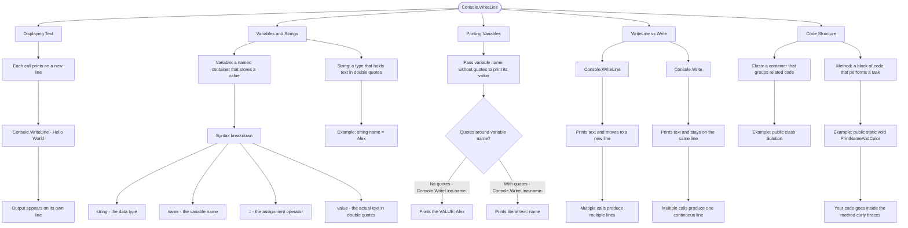

# Console.WriteLine

`Console.WriteLine()` is how you display text to the console in C#. Each call prints on a new line.

```cs
Console.WriteLine("Hello, World!");
// Output: Hello, World!

Console.WriteLine("First line");
Console.WriteLine("Second line");
// Output:
// First line
// Second line
```

## Variables and Strings

A **variable** is a named container that stores a value. Think of it like a labeled box where you can put something and retrieve it later by its name.

A **string** is a type of data that holds text - any sequence of characters like letters, numbers, or symbols surrounded by double quotes.

```cs
string name = "Alex";           // Creates a variable called 'name' that holds the text "Alex"
string favoriteColor = "Blue";  // Creates a variable called 'favoriteColor' that holds "Blue"
```

Breaking down the syntax:

- `string` - the data type (tells C# this variable will hold text)
- `name` - the variable name (you choose this - make it descriptive!)
- `=` - the assignment operator (puts the value into the variable)
- `"Alex"` - the value (the actual text, in double quotes)

## Printing Variables

You can print the value stored in a variable by passing the variable name (without quotes):

```cs
string greeting = "Welcome!";
Console.WriteLine(greeting);
// Output: Welcome!

string city = "London";
Console.WriteLine(city);
// Output: London
```

**Important**: When printing a variable, don't use quotes around the variable name:

```cs
Console.WriteLine(name);    // Prints the VALUE: Alex
Console.WriteLine("name");  // Prints the literal text: name
```

## WriteLine vs Write

| Method                | Description                            |
| --------------------- | -------------------------------------- |
| `Console.WriteLine()` | Prints text and moves to a new line    |
| `Console.Write()`     | Prints text but stays on the same line |

```cs
Console.Write("Hello ");
Console.Write("World");
// Output: Hello World (on one line)

Console.WriteLine("Hello");
Console.WriteLine("World");
// Output:
// Hello
// World
```

## Understanding the Code Structure

In C#, code is organized into **classes** and **methods**:

- **Class**: A container that groups related code together. In this exercise, `Solution` is the class name and `Solution.cs` is the file name. Think of it as a folder that holds your code.
- **Method**: A block of code that performs a specific task. `PrintNameAndColor` is the method name. Methods are like recipes - they contain the instructions to do something.

```cs
public class Solution           // This is the class
{
    public static void PrintNameAndColor()  // This is the method
    {
        // Code goes inside the method where you perform a specific task
    }
}
```

For now, just know that your code goes inside the method (between the curly braces `{ }`). You'll learn more about classes and methods later!

## Topic Visualization


