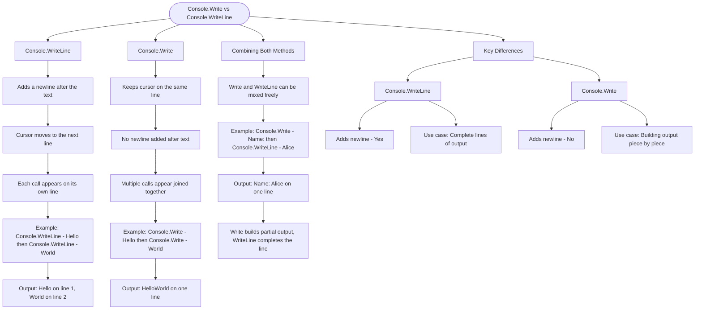

# Console.Write vs Console.WriteLine

In C#, you have two main ways to output text: `Console.WriteLine()` adds a newline after the text, while `Console.Write()` keeps the cursor on the same line.

```cs
// Console.WriteLine adds a newline after output
Console.WriteLine("Hello");
Console.WriteLine("World");
// Output:
// Hello
// World

// Console.Write stays on the same line
Console.Write("Hello");
Console.Write("World");
// Output: HelloWorld
```

## Combining Both Methods

```cs
// You can mix Write and WriteLine
Console.Write("Name: ");
Console.WriteLine("Alice");
// Output: Name: Alice

Console.Write("Score: ");
Console.Write(100);
Console.WriteLine(" points");
// Output: Score: 100 points
```

## Key Differences

| Method                | Adds Newline | Use Case                       |
| --------------------- | ------------ | ------------------------------ |
| `Console.WriteLine()` | Yes          | Complete lines of output       |
| `Console.Write()`     | No           | Building output piece by piece |

## Visualization:


