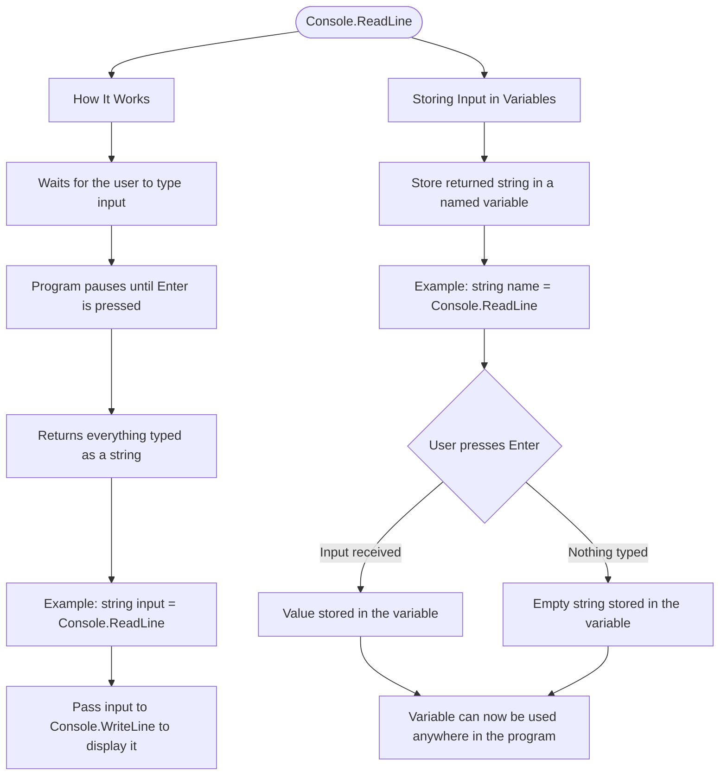

# Console.ReadLine

`Console.ReadLine()` reads a line of text that the user types and returns it as a string. It waits for the user to press Enter, then gives you everything they typed.

```cs
string input = Console.ReadLine();
Console.WriteLine(input);
```

The program pauses at `Console.ReadLine()` until the user types something and presses Enter. Whatever they typed gets stored in the variable.

## Storing Input in Variables

```cs
// Read and store in a variable
string name = Console.ReadLine();

// Now you can use the variable
Console.WriteLine(name);
```

## Visualization


