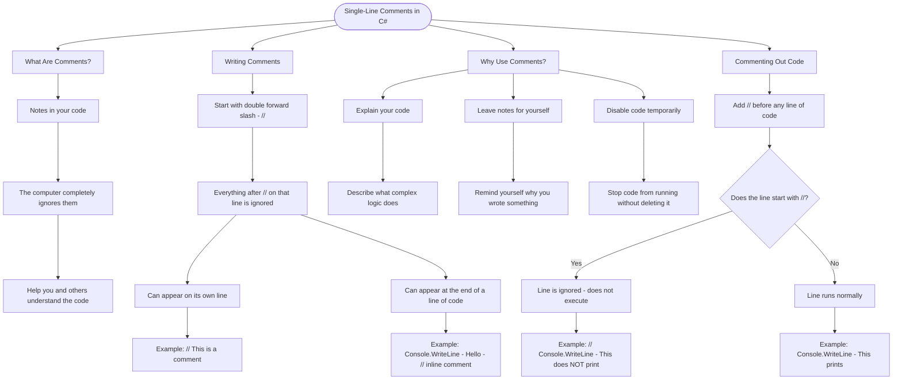

# Single-Line Comments

Comments are notes in your code that the computer ignores. They help you and other programmers understand what the code does.

## Writing Comments

In C#, single-line comments start with `//`. Everything after `//` on that line is ignored.

```cs
// This is a comment - the computer ignores this
Console.WriteLine("Hello"); // You can also comment at the end of a line
```

## Why Use Comments?

- **Explain your code**: Describe what complex logic does
- **Leave notes**: Remind yourself why you wrote something
- **Disable code**: Temporarily stop code from running without deleting it

```cs
// Calculate the area of a circle
double area = 3.14 * radius * radius;

// Console.WriteLine("Debug message"); // This line won't run
```

## Commenting Out Code

You can "comment out" code to disable it temporarily:

```cs
Console.WriteLine("This prints");
// Console.WriteLine("This does NOT print");
```

## Visualization


