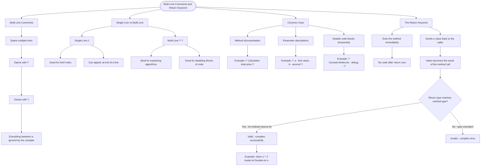

# Multi-Line Comments

Multi-line comments let you write comments that span multiple lines. Use them to explain complex logic, or temporarily disable blocks of code.

## Syntax

```cs
/* This is a
   multi-line comment.
   It can span many lines. */
```

## Single-Line vs Multi-Line Comments

```cs
// Single line - good for brief notes
int x = 5; // Also works at end of line

/* Multi-line comments are ideal for:
   - Explaining algorithms
   - Temporarily disabling code blocks */
```

Common Uses
| Use Case | Example |
|---|---|
| Method docs | `/* Calculates total price */` |
| Parameters | `/* a - first value, b - second */` |
| Disable code | `/* Console.WriteLine("debug"); */` |

## The Return Keyword

The `return` keyword does two things:

- **Exits the method immediately** - no code after return runs
- **Sends a value back to the caller** - the value becomes the result of the method call

```cs
public static int Double(int x)
{
    return x * 2;  // Sends back the doubled value
}

int result = Double(5);  // result is now 10
```

The type after `return` must match the method's return type (e.g., `int` methods must return an `int`).

## Visualization


