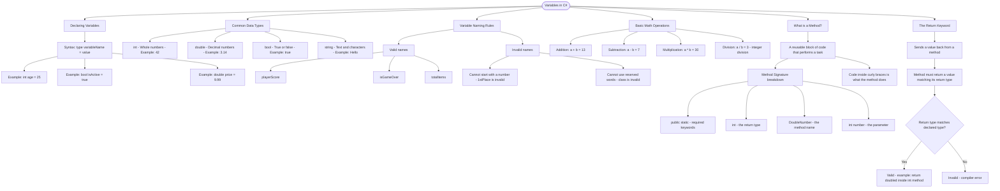

# Variables in C#

Variables are containers that store data values. You declare a variable by specifying its type and giving it a name.

## Declaring Variables

```cs
// Syntax: type variableName = value;
int age = 25;
bool isActive = true;
double price = 9.99;
```

## Common Data Types

```cs
// Syntax: type variableName = value;
int age = 25;
bool isActive = true;
double price = 9.99;
```

## Common Data Types

| Type     | Description     | Example   |
| -------- | --------------- | --------- |
| `int`    | Whole numbers   | `42`      |
| `double` | Decimal numbers | `3.14`    |
| `bool`   | True or false   | `true`    |
| `string` | Text/characters | `"Hello"` |

## Variable Naming Rules

```cs
// Valid variable names
int playerScore = 100;
bool isGameOver = false;
int totalItems = 5;

// Invalid - cannot start with number
// int 1stPlace = 1;  // Error!

// Invalid - cannot use reserved words
// int class = 5;  // Error!
```

## Basic Math Operations

You can perform calculations with numbers:

```cs
int a = 10;
int b = 3;

int sum = a + b;       // 13
int difference = a - b; // 7
int product = a * b;    // 30
int quotient = a / b;   // 3 (integer division)
```

## What is a Method?

A **method** is a reusable block of code that performs a specific task. Think of it like a recipe - you give it ingredients (inputs), it follows instructions, and gives you a result (output).

```cs
// This is a method that takes a number and returns its double
public static int DoubleNumber(int number)
{
    // The code inside the { } is what the method does
    int result = number * 2;
    return result;  // This sends the result back
}
```

**Breaking down the method signature**:

- `public static` - Don't worry about these for now, they're required keywords
- `int` - The **return type** - what kind of value this method gives back
- `DoubleNumber` - The **name** of the method
- `(int number)` - The **parameter** - input the method receives

## The `return` Keyword

The `return` keyword sends a value back from a method. Think of it like giving an answer to a question:

```cs
// Someone asks: "What's double of 5?"
// The method answers: 10

public static int DoubleNumber(int number)
{
    int doubled = number * 2;
    return doubled;  // This is the answer!
}
```

When a method has a return type (like `int`), it must use `return` to send back a value of that type.

## Visualization


