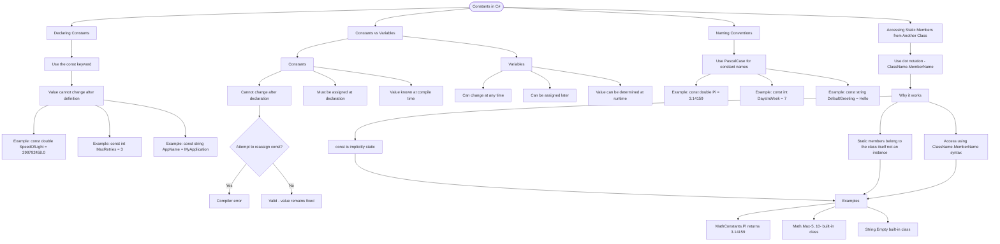

# Constants in C#

A constant is a value that cannot change after it's defined. Use the `const` keyword to declare values that remain fixed throughout your program.

## Declaring Constants

```cs
const double SpeedOfLight = 299792458.0;
const int MaxRetries = 3;
const string AppName = "MyApplication";
```

## Constants vs Variables

| Feature          | Constant (`const`)     | Variable             |
| ---------------- | ---------------------- | -------------------- |
| Can change       | No                     | Yes                  |
| Must be assigned | At declaration         | Can be later         |
| Compile-time     | Value known at compile | Value can be runtime |

```cs
const int MaxScore = 100;    // Cannot change
int currentScore = 0;         // Can change
currentScore = 50;            // OK
// MaxScore = 200;            // ERROR: Cannot assign to const
```

## Naming Conventions

C# constants typically use **PascalCase**:

```cs
const double Pi = 3.14159;
const int DaysInWeek = 7;
const string DefaultGreeting = "Hello";
```

## Accessing Static Members from Another Class

When constants (or any static members) are defined in a separate class, you access them using the **class name** followed by a **dot** and the **member name**. This is called **dot notation**.

```cs
// In MathConstants class:
public static class MathConstants
{
  public const double Pi = 3.14159;
  public const int DaysInWeek = 7;
}

// To use these constants from another class:
double circleConstant = MathConstants.Pi; // Returns 3.14159
int days = MathConstants.DaysInWeek; // Returns 7
```

**Why does this work?**

- The `const` keyword makes the value a **static member** of the class (constants are implicitly static).
- Static members belong to the **class itself**, not to any instance.
- You access static members using `ClassName.MemberName` syntax.

```cs
// This pattern applies to all static members:
int result = Math.Max(5, 10); // Built-in Math class
string text = String.Empty; // Built-in String class
double pi = MathConstants.Pi; // Our custom class
```

## Visualization


