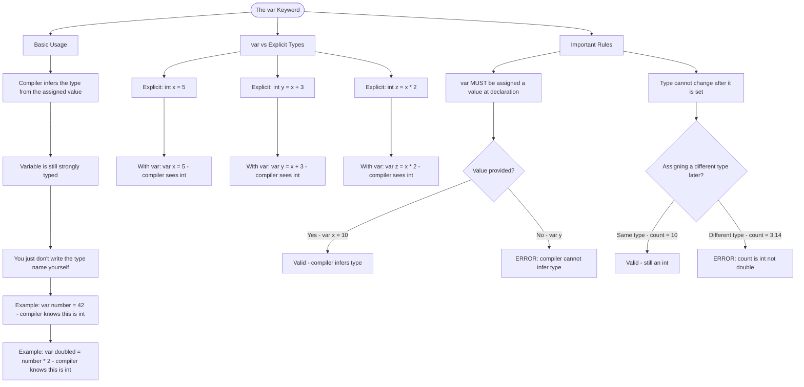

# The var Keyword

The `var` keyword lets the compiler figure out the type of a variable from the value you assign to it. The variable is still strongly typed, but you don't have to write the type name yourself.

## Basic Usage

```cs
// Instead of writing:
int number = 42;
int doubled = number * 2;

// You can write:
var number = 42;      // Compiler knows this is an int
var doubled = number * 2;   // Compiler knows this is also an int
```

## var vs Explicit Types

| Explicit Type    | With var         | What the Compiler Sees |
| ---------------- | ---------------- | ---------------------- |
| `int x = 5;`     | `var x = 5;`     | `int`                  |
| `int y = x + 3;` | `var y = x + 3;` | `int`                  |
| `int z = x * 2;` | `var z = x * 2;` | `int`                  |

## Important Rules

```cs
// var MUST have a value - the compiler needs it to know the type
var x = 10;    // Valid
// var y;       // ERROR: Cannot use var without a value

// The type cannot change after it's set
var count = 5;
count = 10;    // Valid - still an int
// count = 3.14;  // ERROR: count is an int, not a double
```

## Visualization


