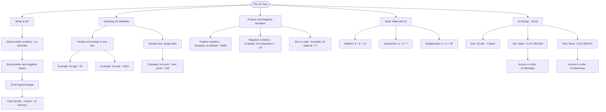

# The int Type

The `int` type stores whole numbers (integers) - both positive and negative values, but no decimals. It is a **32-bit signed integer**, meaning it uses 32 bits (4 bytes) of memory to store values.

## Declaring int Variables

```cs
// Declare and assign in one line
int age = 25;
int year = 2024;

// Declare first, assign later
int score;
score = 100;
```

## Positive and Negative Numbers

```cs
int temperature = -10; // Negative number
int altitude = 8848; // Positive number
int balance = 0; // Zero is valid too
```

## Basic Math with int

```cs
int a = 10;
int b = 3;
int sum = a + b; // 13
int difference = a - b; // 7
int product = a \* b; // 30
```

## int Range (32-bit)

Because `int` is a 32-bit signed integer, it can store values in this range:

| Property  | Value             |
| --------- | ----------------- |
| Size      | 32 bits (4 bytes) |
| Min Value | -2,147,483,648    |
| Max Value | 2,147,483,647     |

You can access these limits in code using `int.MinValue` and `int.MaxValue`.

# Visualization


