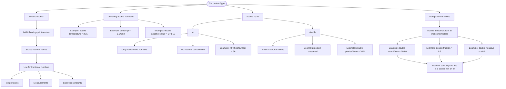

# The double Type

A `double` is a 64-bit floating-point number used for storing decimal values. Use it when you need to represent fractional numbers like temperatures, measurements, or scientific constants.

## Declaring double Variables

```cs
// Declare and assign a double variable
double temperature = 36.5;
double pi = 3.14159;
double negativeValue = -273.15;
```

## double vs int

Integers (`int`) can only hold whole numbers without decimal parts. When you need precision with fractional values, use `double`.

```cs
int wholeNumber = 36;        // No decimal allowed
double preciseValue = 36.5;  // Decimal values preserved
```

## Using Decimal Points

When assigning values to doubles, include a decimal point to make your intent clear:

```cs
double exactValue = 100.0;   // Clear: this is a double
double fraction = 0.5;       // Decimal values work perfectly
double negative = -40.0;     // Negative decimals too
```

# Visualization


