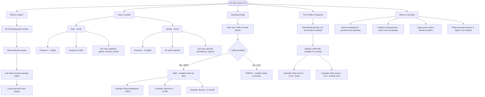

# The float Type

A `float` is a 32-bit floating-point number used for storing decimal values when you need to save memory and don't require high precision.

## float vs double

| Type     | Size   | Precision  | Suffix | Use Case                         |
| -------- | ------ | ---------- | ------ | -------------------------------- |
| `float`  | 32-bit | ~7 digits  | `f`    | Graphics, games, memory-critical |
| `double` | 64-bit | ~15 digits | none   | General calculations, science    |

## Declaring Floats

```cs
// Must use 'f' suffix for float literals
float temperature = 98.6f;
float price = 19.99f;
float pi = 3.14159f;

// Without 'f', the compiler treats it as double (error!)
// float wrong = 3.14; // Compile error!
```

## The 'f' Suffix is Required

In C#, decimal literals like `3.14` are treated as `double` by default. To create a `float`, you must add the `f` suffix:

```cs
float correct = 3.14f; // Works!
float alsoCorrect = 0.5f; // Works!
// float wrong = 3.14; // Error: cannot convert double to float
```

## When to Use float

- Game development (positions, velocities)
- Graphics programming (colors, coordinates)
- Large arrays where memory matters
- When precision beyond 7 digits isn't needed

# Visualization


