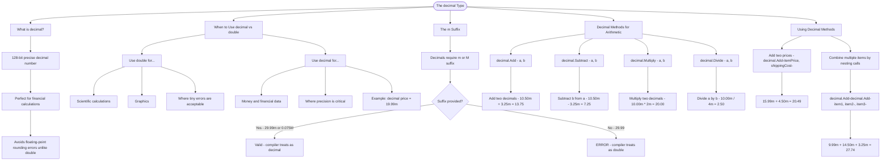

# Decimals

The `decimal` type is a 128-bit precise decimal number, perfect for financial calculations where accuracy matters. Unlike `double`, decimals avoid floating-point rounding errors.

## When to Use Decimal vs Double

```cs
// Double: scientific calculations, graphics, where tiny errors are OK
double distance = 3.14159265358979;

// Decimal: money, financial data, where precision is critical
decimal price = 19.99m; // Note the 'm' suffix!
decimal taxAmount = 1.60m;
```

## The 'm' Suffix

Decimals require the `m` or `M` suffix to distinguish them from doubles:

```cs
decimal cost = 29.99m; // Correct
decimal rate = 0.075M; // Also correct
// decimal wrong = 29.99; // Error! Compiler sees this as double
```

## Decimal Methods for Arithmetic

The `decimal` type provides static methods for performing arithmetic without using operators:

| Method                   | Description           | Example                                  |
| ------------------------ | --------------------- | ---------------------------------------- |
| `decimal.Add(a, b)`      | Add two decimals      | `decimal.Add(10.50m, 3.25m)` = 13.75     |
| `decimal.Subtract(a, b)` | Subtract b from a     | `decimal.Subtract(10.50m, 3.25m)` = 7.25 |
| `decimal.Multiply(a, b)` | Multiply two decimals | `decimal.Multiply(10.00m, 2m)` = 20.00   |
| `decimal.Divide(a, b)`   | Divide a by b         | `decimal.Divide(10.00m, 4m)` = 2.50      |

## Using Decimal Methods

```cs
decimal itemPrice = 15.99m;
decimal shippingCost = 4.50m;

// Add two prices together
decimal total = decimal.Add(itemPrice, shippingCost); // 20.49

// Combine multiple items
decimal item1 = 9.99m;
decimal item2 = 14.50m;
decimal item3 = 3.25m;
decimal subtotal = decimal.Add(decimal.Add(item1, item2), item3); // 27.74
```

# Visualization


