# Verbatim Strings

A verbatim string literal starts with `@` before the opening quote. It tells C# to treat the string exactly as written, ignoring escape sequences like `\n` or `\t`.

## Why Use Verbatim Strings?

Verbatim strings solve a common problem: **readability when dealing with backslashes and multi-line text**. Without them, file paths and regex patterns become cluttered with escape characters.

## Regular vs Verbatim Strings

```cs
// Regular string - backslashes need escaping (doubled)
string regular = "C:\\Users\\Admin\\file.txt";

// Verbatim string - backslashes work as-is
string verbatim = @"C:\Users\Admin\file.txt";

// Both produce: C:\Users\Admin\file.txt
```

## Multi-line Text

Verbatim strings preserve line breaks exactly as written:

```cs
string poem = @"Roses are red,
Violets are blue,
C# is awesome,
And so are you!";
```

## Quotes in Verbatim Strings

To include a quote inside a verbatim string, double it:

```cs
string withQuote = @"She said ""Hello"" to me.";
// Output: She said "Hello" to me.
```

## When to Use Verbatim Strings

| Use Case           | Why It Helps                    | Example                   |
| ------------------ | ------------------------------- | ------------------------- |
| File paths         | Avoids doubling every backslash | `@"C:\Program Files\App"` |
| Regex patterns     | Regex uses many backslashes     | `@"\d{3}-\d{4}"`          |
| Multi-line text    | Preserves formatting naturally  | SQL queries, templates    |
| JSON/XML templates | Keeps structure readable        | Embedded config           |

## When NOT to Use Verbatim Strings

- **When you need escape sequences**: `\n`, `\t`, `\r` are treated as literal text in verbatim strings
- **Short, simple strings**: No benefit for @"Hello" vs "Hello"
- **Dynamic newlines**: Use regular strings with \n when building strings programmatically

## Potential Downsides

- **Accidental whitespace**: Leading spaces on continuation lines are included
- **No escape sequences**: Can't use `\n` for newline - must use actual line breaks
- **Quote escaping**: Doubling quotes `""` can look confusing in complex strings

# Visualization

```mermaid
flowchart TD
    A([Verbatim Strings in C#]) --> B[What Are Verbatim Strings?]
    A --> C[Regular vs Verbatim Strings]
    A --> D[Multi-line Text]
    A --> E[Quotes in Verbatim Strings]
    A --> F[When to Use]
    A --> G[When NOT to Use and Downsides]

    B --> B1[Start with @ before the opening quote]
    B1 --> B2[Tells C# to treat the string exactly as written]
    B2 --> B3[Ignores escape sequences like \n or \t]
    B3 --> B4[Solves readability issues with backslashes and multi-line text]

    C --> C1[Regular string]
    C --> C2[Verbatim string]
    C1 --> C1a[Backslashes must be doubled - escaped]
    C1 --> C1b[Example: C:\\Users\\Admin\\file.txt]
    C2 --> C2a[Backslashes work as-is]
    C2 --> C2b[Example: @C:\Users\Admin\file.txt]
    C1b --> C3[Both produce the same output: C:\Users\Admin\file.txt]
    C2b --> C3

    D --> D1[Line breaks preserved exactly as written in code]
    D1 --> D2[No need for \n characters]
    D2 --> D3[Example: multi-line poem stored in one string variable]

    E --> E1[Cannot use backslash-quote inside verbatim string]
    E1 --> E2[Instead double the quote character]
    E2 --> E3[Example: She said Hello in doubled quotes]
    E3 --> E4[Output: She said Hello with surrounding quotes]

    F --> F1[File paths - avoids doubling every backslash]
    F --> F2[Regex patterns - regex uses many backslashes]
    F --> F3[Multi-line text - preserves formatting naturally]
    F --> F4[JSON and XML templates - keeps structure readable]

    G --> G1[When NOT to use]
    G --> G2[Potential downsides]
    G1 --> G1a[When you need escape sequences like \n or \t]
    G1 --> G1b[Short simple strings - no benefit over regular strings]
    G1 --> G1c[Dynamic newlines built programmatically]
    G2 --> G2a[Accidental whitespace - leading spaces are included]
    G2 --> G2b[No escape sequences - must use actual line breaks]
    G2 --> G2c[Doubled quotes can look confusing in complex strings]
```


