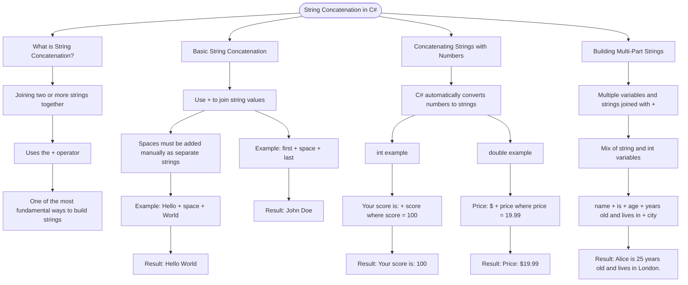

# String Concatenation

String concatenation is the process of joining two or more strings together using the `+` operator. It's one of the most fundamental ways to build strings in C#.

## Basic String Concatenation

```cs
string greeting = "Hello" + " " + "World";
// Result: "Hello World"

string first = "John";
string last = "Doe";
string fullName = first + " " + last;
// Result: "John Doe"
```

## Concatenating Strings with Numbers

When you concatenate a string with a number, C# automatically converts the number to a string:

```cs
int score = 100;
string message = "Your score is: " + score;
// Result: "Your score is: 100"

double price = 19.99;
string priceTag = "Price: $" + price;
// Result: "Price: $19.99"
```

## Building Multi-Part Strings

```cs
string name = "Alice";
int age = 25;
string city = "London";

string bio = name + " is " + age + " years old and lives in " + city + ".";
// Result: "Alice is 25 years old and lives in London."
```

# Visualization


