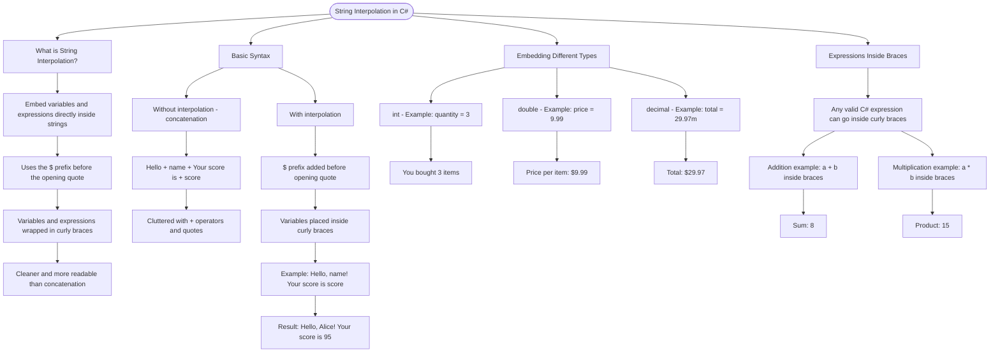

# String Interpolation

String interpolation lets you embed variables and expressions directly inside strings using the `$` prefix and curly braces `{}`.

## Basic Syntax

```cs
string name = "Alice";
int score = 95;

// Without interpolation (concatenation)
string message1 = "Hello, " + name + "! Your score is " + score + ".";

// With interpolation (cleaner!)
string message2 = $"Hello, {name}! Your score is {score}.";
```

## Embedding Different Types

```cs
int quantity = 3;
double price = 9.99;
decimal total = 29.97m;

Console.WriteLine($"You bought {quantity} items");
Console.WriteLine($"Price per item: ${price}");
Console.WriteLine($"Total: ${total}");
```

## Expressions Inside Braces

You can put any C# expression inside the curly braces:

```cs
int a = 5;
int b = 3;
Console.WriteLine($"Sum: {a + b}");  // Prints: Sum: 8
Console.WriteLine($"Product: {a * b}");  // Prints: Product: 15
```

# Visualization


