# Chars in C#

A `char` represents a single Unicode character. While strings hold multiple characters, a char holds exactly one. Use char when working with individual characters from strings or keyboard input.

## Declaring Chars

```cs
char letter = 'A';       // Use single quotes for char literals
char digit = '7';
char symbol = '@';
char newline = '\n';     // Escape sequences work too
```

## Chars vs Strings

| Type     | Syntax        | Example | Length    |
| -------- | ------------- | ------- | --------- |
| `char`   | Single quotes | `'A'`   | Always 1  |
| `string` | Double quotes | `"A"`   | 0 or more |

```cs
char c = 'H'; // Single character
string s = "H"; // String with one character
string empty = ""; // Valid - empty string
// char empty = ''; // ERROR - char must have exactly one character
```

Useful Char Methods
| Method | Description | Example |
|---|---|---|
| `char.IsLetter(c)` | Is it a letter? | `char.IsLetter('A')` → `True` |
| `char.IsDigit(c)` | Is it a digit 0-9? | `char.IsDigit('5')` → `True` |
| `char.IsUpper(c)` | Is it uppercase? | `char.IsUpper('a')` → `False` |
| `char.IsLower(c)` | Is it lowercase? | `char.IsLower('a')` → `True` |
| `char.ToUpper(c)` | Convert to uppercase | `char.ToUpper('a')` → `'A'` |
| `char.ToLower(c)` | Convert to lowercase | `char.ToLower('A')` → `'a'` |

# Visualization

```mermaid
flowchart TD
    A([Chars in C#]) --> B[What is a char?]
    A --> C[Declaring Chars]
    A --> D[Chars vs Strings]
    A --> E[Useful Char Methods]

    B --> B1[Represents a single Unicode character]
    B1 --> B2[Holds exactly one character]
    B2 --> B3[Use when working with individual characters]
    B3 --> B3a[From strings]
    B3 --> B3b[From keyboard input]

    C --> C1[Use single quotes for char literals]
    C1 --> C2[Example: char letter = A in single quotes]
    C1 --> C3[Example: char digit = 7 in single quotes]
    C1 --> C4[Example: char symbol = @ in single quotes]
    C1 --> C5[Escape sequences also work - char newline = \n]

    D --> D1[char - single quotes - always exactly 1 character]
    D --> D2[string - double quotes - 0 or more characters]
    D1 --> D1a[Example: char c = H in single quotes]
    D2 --> D2a[Example: string s = H in double quotes]
    D2 --> D2b[Empty string is valid - string empty = empty quotes]
    D1 --> D3{Empty char?}
    D3 --> |Yes - char empty = empty single quotes| D4[ERROR - char must have exactly one character]
    D3 --> |No - one character provided| D5[Valid]

    E --> E1[char.IsLetter - is it a letter?]
    E --> E2[char.IsDigit - is it a digit 0-9?]
    E --> E3[char.IsUpper - is it uppercase?]
    E --> E4[char.IsLower - is it lowercase?]
    E --> E5[char.ToUpper - convert to uppercase]
    E --> E6[char.ToLower - convert to lowercase]
    E1 --> E1a[char.IsLetter of A returns True]
    E2 --> E2a[char.IsDigit of 5 returns True]
    E3 --> E3a[char.IsUpper of lowercase a returns False]
    E4 --> E4a[char.IsLower of lowercase a returns True]
    E5 --> E5a[char.ToUpper of lowercase a returns uppercase A]
    E6 --> E6a[char.ToLower of uppercase A returns lowercase a]
```


