# Booleans

A `bool` (short for Boolean) represents a logical value that can only be `true` or `false`. Booleans are essential for making decisions in your code.

## Declaration and Assignment

```cs
bool isActive = true;
bool isComplete = false;
bool hasPermission = true;
```

## Combining Booleans with Logical Operators

| Operator | Name | Description               | Example                    |
| -------- | ---- | ------------------------- | -------------------------- |
| `&&`     | AND  | Both must be true         | `true && true` → `true`    |
| `\|\|`   | OR   | At least one must be true | `true \|\| false` → `true` |
| `!`      | NOT  | Inverts the value         | `!true` → `false`          |

```cs
bool canDrive = hasLicense && isAdult; // Both conditions must be true
bool canEnter = isVIP || hasPaid; // Either condition can be true
bool isLocked = !isOpen; // Opposite of isOpen
```

## Truth Tables

Understanding how logical operators work with different combinations:

**AND (`&&`)** - Both must be true:

| A       | B       | A && B  |
| ------- | ------- | ------- |
| `true`  | `true`  | `true`  |
| `true`  | `false` | `false` |
| `false` | `true`  | `false` |
| `false` | `false` | `false` |

**OR (`||`)** - At least one must be true:

| A       | B       | A \|\| B |
| ------- | ------- | -------- |
| `true`  | `true`  | `true`   |
| `true`  | `false` | `true`   |
| `false` | `true`  | `true`   |
| `false` | `false` | `false`  |

# Visualization

```mermaid
flowchart TD
    A([Booleans in C#]) --> B[What is a bool?]
    A --> C[Declaration and Assignment]
    A --> D[Logical Operators]
    A --> E[Truth Tables]

    B --> B1[Short for Boolean]
    B1 --> B2[Can only be true or false]
    B2 --> B3[Essential for making decisions in code]

    C --> C1[Example: bool isActive = true]
    C --> C2[Example: bool isComplete = false]
    C --> C3[Example: bool hasPermission = true]

    D --> D1[AND - &&]
    D --> D2[OR - double pipe]
    D --> D3[NOT - !]
    D1 --> D1a[Both conditions must be true]
    D1 --> D1b[Example: canDrive = hasLicense AND isAdult]
    D1b --> D1c[true && true returns true]
    D1b --> D1d[true && false returns false]
    D2 --> D2a[At least one condition must be true]
    D2 --> D2b[Example: canEnter = isVIP OR hasPaid]
    D2b --> D2c[true OR false returns true]
    D2b --> D2d[false OR false returns false]
    D3 --> D3a[Inverts the value]
    D3 --> D3b[Example: isLocked = NOT isOpen]
    D3b --> D3c[!true returns false]
    D3b --> D3d[!false returns true]

    E --> E1[AND truth table]
    E --> E2[OR truth table]
    E1 --> E1a[true AND true = true]
    E1 --> E1b[true AND false = false]
    E1 --> E1c[false AND true = false]
    E1 --> E1d[false AND false = false]
    E2 --> E2a[true OR true = true]
    E2 --> E2b[true OR false = true]
    E2 --> E2c[false OR true = true]
    E2 --> E2d[false OR false = false]
```


