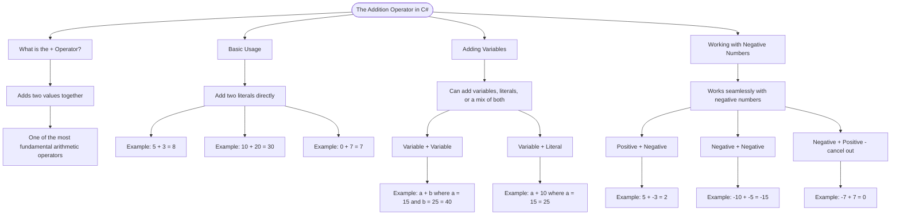

# The Addition Operator

The `+` operator adds two values together. It's one of the most fundamental arithmetic operators in C#.

## Basic Usage

```cs
int sum = 5 + 3;      // sum = 8
int total = 10 + 20;  // total = 30
int result = 0 + 7;   // result = 7
```

## Adding Variables

You can add variables, literals, or a mix of both:

```cs
int a = 15;
int b = 25;
int sum = a + b;      // sum = 40
int mixed = a + 10;   // mixed = 25
```

## Working with Negative Numbers

The addition operator works seamlessly with negative numbers:

```cs
int result1 = 5 + (-3);   // result1 = 2
int result2 = -10 + -5;   // result2 = -15
int result3 = -7 + 7;     // result3 = 0
```

# Visualization



The flowchart branches into four sections. **What is the + Operator?** establishes the concept, **Basic Usage** shows literal addition examples, **Adding Variables** covers the three combinations of variables and literals, and **Working with Negative Numbers** maps the three scenarios of mixing positive and negative values.
