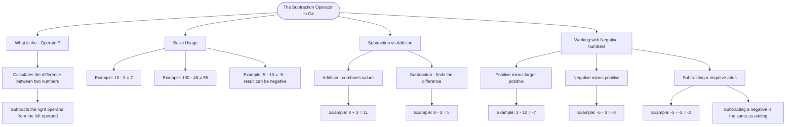

# The Subtraction Operator

The subtraction operator (`-`) calculates the difference between two numbers. It subtracts the right operand from the left operand.

## Basic Usage

```cs
int result = 10 - 3;    // result is 7
int diff = 100 - 45;    // diff is 55
int negative = 5 - 10;  // negative is -5
```

## Subtraction vs Addition

While addition combines values, subtraction finds the difference:

```cs
int sum = 8 + 3;        // 11 (combining)
int difference = 8 - 3; // 5 (finding difference)
```

## Working with Negative Numbers

Subtraction can produce negative results and works with negative operands:

```cs
int result1 = 3 - 10;     // -7 (positive minus larger positive)
int result2 = -5 - 3;     // -8 (negative minus positive)
int result3 = -5 - (-3);  // -2 (subtracting negative adds)
```

# Visualization



The flowchart branches into four sections. **What is the - Operator?** establishes the definition, **Basic Usage** shows three examples including a negative result, **Subtraction vs Addition** contrasts the two operators side by side, and **Working with Negative Numbers** covers the three scenarios of mixing positive and negative operands including the important rule that subtracting a negative adds.
