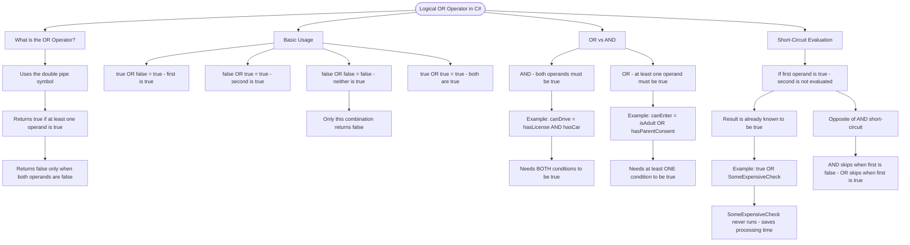

# Logical OR Operator

The logical OR operator (`||`) returns `true` if **at least one** of its operands is true. It's used when you need to check if any condition among several is satisfied.

## Basic Usage

```cs
bool result1 = true || false;   // true (first is true)
bool result2 = false || true;   // true (second is true)
bool result3 = false || false;  // false (neither is true)
bool result4 = true || true;    // true (both are true)
```

## OR vs AND

| Operator | Symbol | Returns true when...         |
| -------- | ------ | ---------------------------- |
| AND      | `&&`   | Both operands are true       |
| OR       | `\|\|` | At least one operand is true |

|

```cs
// AND - both must be true
bool canDrive = hasLicense && hasCar;  // needs BOTH

// OR - either can be true
bool canEnter = isAdult || hasParentConsent;  // needs at least ONE
```

## Short-Circuit Evaluation

The OR operator uses short-circuit evaluation: if the first operand is `true`, the second operand is **not evaluated** because the result is already known to be `true`.

```cs
bool result = true || SomeExpensiveCheck();  // SomeExpensiveCheck() never runs!
```

# Visualization



The flowchart branches into four sections. **What is the OR Operator?** establishes the core rule, **Basic Usage** maps all four boolean combinations highlighting the only one that returns false, **OR vs AND** contrasts the two operators with real-world examples showing the difference between needing both vs needing one, and **Short-Circuit Evaluation** explains how OR skips the second operand when the first is already true, noting how this is the opposite of AND's short-circuit behaviour.
