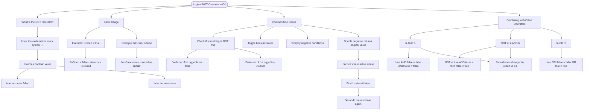

# Logical NOT Operator

The logical NOT operator (`!`) inverts a boolean value. If a value is `true`, it becomes `false`, and vice versa.

## Basic Usage

```cs
bool isOpen = true;
bool isClosed = !isOpen;  // false

bool hasError = false;
bool isValid = !hasError; // true
```

## Common Use Cases

The NOT operator is frequently used to:

- Check if something is NOT true
- Toggle boolean states
- Simplify negative conditions

```cs
// Instead of checking == false
if (isLoggedIn == false) { }  // Works but verbose

// Use the NOT operator
if (!isLoggedIn) { }          // Cleaner and preferred

// Double negation returns original value
bool active = true;
bool result = !!active;  // true (negated twice)
```

## Combining with Other Operators

```cs
bool a = true;
bool b = false;

bool result1 = !a && b;   // false && false = false
bool result2 = !(a && b); // !(true && false) = !false = true
bool result3 = !a || !b;  // false || true = true
```

# Visualization



The flowchart branches into four sections. **What is the NOT Operator?** establishes the inversion rule for both directions, **Basic Usage** traces two concrete examples showing the value flip, **Common Use Cases** covers the three main scenarios including the double negation behaviour, and **Combining with Other Operators** shows how placement of the NOT operator changes results, highlighting the key difference between `!a && b` and `!(a && b)`.
