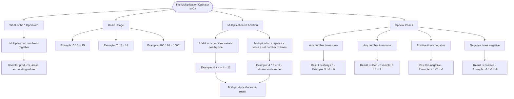

# Multiplication Operator

The multiplication operator `*` multiplies two numbers together. It's used whenever you need to calculate products, areas, or scale values.

## Basic Usage

```cs
int product = 5 * 3;     // product = 15
int doubled = 7 * 2;     // doubled = 14
int scaled = 100 * 10;   // scaled = 1000
```

## Multiplication vs Addition

While addition combines values, multiplication repeats a value a certain number of times:

```cs
// Adding 4 three times
int sum = 4 + 4 + 4;      // sum = 12

// Multiplying is shorter
int product = 4 * 3;      // product = 12
```

## Special Cases

```cs
int zero = 5 * 0;         // Any number times zero = 0
int same = 8 * 1;         // Any number times one = itself (8)
int negative = 4 * -2;    // Positive times negative = negative (-8)
int positive = -3 * -3;   // Negative times negative = positive (9)
```

# Visualization



The flowchart branches into four sections. **What is the \* Operator?** establishes the definition and use cases, **Basic Usage** shows three straightforward examples, **Multiplication vs Addition** contrasts the two operators converging on the same result, and **Special Cases** maps the four key rules around zero, one, and sign combinations.
