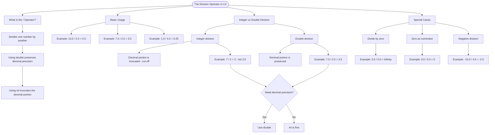

# Division Operator

The division operator `/` divides one number by another. Unlike integer division, using `double` preserves decimal precision.

## Basic Usage

```cs
double result1 = 10.0 / 2.0;  // result1 = 5.0
double result2 = 7.0 / 2.0;   // result2 = 3.5
double result3 = 1.0 / 4.0;   // result3 = 0.25
```

## Integer vs Double Division

When dividing integers, C# truncates the decimal portion. Using `double` preserves it.

```cs
int intResult = 7 / 2;        // intResult = 3 (truncated!)
double doubleResult = 7.0 / 2.0;  // doubleResult = 3.5 (preserved)
```

## Special Cases

```cs
double divByZero = 5.0 / 0.0;     // Result: Infinity
double zeroNumerator = 0.0 / 5.0; // Result: 0
double negResult = -10.0 / 4.0;   // Result: -2.5
```

# Visualization



The flowchart branches into four sections. **What is the / Operator?** establishes the definition and the key distinction between int and double behaviour, **Basic Usage** shows three double division examples, **Integer vs Double Division** contrasts the two with a decision point on whether decimal precision is needed, and **Special Cases** maps the three edge case scenarios and their results.
