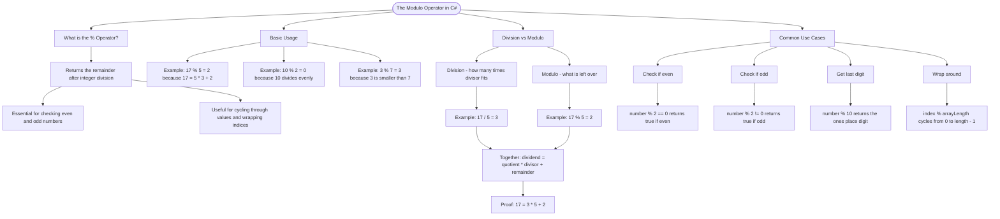

# The Modulo Operator

The modulo operator (`%`) returns the remainder after integer division. It's essential for tasks like checking even/odd numbers, cycling through values, and wrapping indices.

## Basic Usage

```cs
int remainder = 17 % 5;  // 2 (because 17 = 5 * 3 + 2)
int noRemainder = 10 % 2; // 0 (10 divides evenly by 2)
int smallerDividend = 3 % 7; // 3 (3 is less than 7, so remainder is 3)
```

## Division vs Modulo

```cs
// Division gives you how many times divisor fits
int quotient = 17 / 5;   // 3

// Modulo gives you what's left over
int remainder = 17 % 5;  // 2

// Together they satisfy: dividend = (quotient * divisor) + remainder
// 17 = (3 * 5) + 2 ✓
```

## Common Use Cases

| Pattern        | Example               | Result               |
| -------------- | --------------------- | -------------------- |
| Check if even  | `number % 2 == 0`     | true if even         |
| Check if odd   | `number % 2 != 0`     | true if odd          |
| Get last digit | `number % 10`         | ones place           |
| Wrap around    | `index % arrayLength` | cycles 0 to length-1 |

# Visualization



The flowchart branches into four sections. **What is the % Operator?** establishes the definition and key use cases, **Basic Usage** covers the three core scenarios including when the dividend is smaller than the divisor, **Division vs Modulo** contrasts the two operators and shows how they relate through the remainder formula, and **Common Use Cases** maps each pattern to its example and result.
