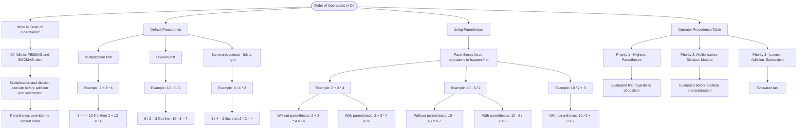

# Order of Operations

C# follows mathematical precedence rules (PEMDAS/BODMAS). Multiplication and division execute before addition and subtraction. Parentheses override this default order.

## Default Precedence

```cs
int result1 = 2 + 3 * 4;    // = 2 + 12 = 14 (multiplication first)
int result2 = 10 - 6 / 2;   // = 10 - 3 = 7 (division first)
int result3 = 8 / 4 * 2;    // = 2 * 2 = 4 (left to right for same precedence)
```

## Using Parentheses

Parentheses force operations to happen first, regardless of default precedence.

```cs
int result1 = (2 + 3) * 4;  // = 5 * 4 = 20 (parentheses first)
int result2 = (10 - 6) / 2; // = 4 / 2 = 2 (parentheses first)
int result3 = 10 / (2 + 3); // = 10 / 5 = 2 (parentheses first)
```

## Operator Precedence Table

| Priority | Operators     | Description                      |
| -------- | ------------- | -------------------------------- |
| 1 (High) | `( )`         | Parentheses                      |
| 2        | `*`, `/`, `%` | Multiplication, Division, Modulo |
| 3 (Low)  | `+`, `-`      | Addition, Subtraction            |



The flowchart branches into four sections. **What is Order of Operations?** establishes the PEMDAS rules, **Default Precedence** traces three examples showing how multiplication, division, and same-level operators are evaluated, **Using Parentheses** contrasts results with and without parentheses for each example, and **Operator Precedence Table** maps the three priority levels from highest to lowest.
