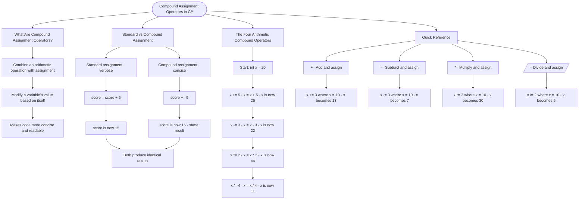

# Compound Assignment Operators

Compound assignment operators combine an arithmetic operation with assignment, making code more concise when you want to modify a variable's value based on itself.

## Standard vs Compound Assignment

```cs
// Standard assignment - verbose
int score = 10;
score = score + 5;  // score is now 15

// Compound assignment - concise
int score = 10;
score += 5;  // score is now 15 (same result!)
```

## The Four Arithmetic Compound Operators

```cs
int x = 20;

x += 5;   // x = x + 5  → x is now 25
x -= 3;   // x = x - 3  → x is now 22
x *= 2;   // x = x * 2  → x is now 44
x /= 4;   // x = x / 4  → x is now 11
```

## Quick Reference

| Operator | Meaning             | Example  | Result (if x = 10) |
| -------- | ------------------- | -------- | ------------------ |
| `+=`     | Add and assign      | `x += 3` | x becomes 13       |
| `-=`     | Subtract and assign | `x -= 3` | x becomes 7        |
| `*=`     | Multiply and assign | `x *= 3` | x becomes 30       |
| `/=`     | Divide and assign   | `x /= 2` | x becomes 5        |

# Visualization



The flowchart branches into four sections. **What Are Compound Assignment Operators?** establishes the concept, **Standard vs Compound Assignment** contrasts the two approaches converging on the same result, **The Four Arithmetic Compound Operators** traces a sequential chain showing how x changes with each operation, and **Quick Reference** maps each operator to its meaning and result when starting from x = 10.
