# Increment and Decrement Operators

The `++` (increment) and `--` (decrement) operators add or subtract 1 from a variable. They come in two forms: **prefix** and **postfix**, which behave differently when used in expressions.

## Post-increment and Post-decrement (value++ / value--)

```cs
int x = 5;
int result = x++;  // result = 5, x = 6 (returns original, then changes)

int y = 10;
int result2 = y--; // result2 = 10, y = 9 (returns original, then changes)
```

The **postfix** version returns the **original value** before making the change.

## Pre-increment and Pre-decrement (++value / --value)

```cs
int x = 5;
int result = ++x;  // result = 6, x = 6 (changes first, then returns)

int y = 10;
int result2 = --y; // result2 = 9, y = 9 (changes first, then returns)
```

The **prefix** version makes the change **first**, then returns the new value.

## Key Differences Summary

| Operator | Name           | Behavior                  | Example (x=5)          |
| -------- | -------------- | ------------------------- | ---------------------- |
| `x++`    | Post-increment | Return x, then add 1      | Returns 5, x becomes 6 |
| `++x`    | Pre-increment  | Add 1, then return x      | Returns 6, x becomes 6 |
| `x--`    | Post-decrement | Return x, then subtract 1 | Returns 5, x becomes 4 |
| `--x`    | Pre-decrement  | Subtract 1, then return x | Returns 4, x becomes 4 |

# Visualization

```mermaid
flowchart TD
    A([Increment and Decrement Operators in C#]) --> B[What Are They?]
    A --> C[Postfix - value++ and value--]
    A --> D[Prefix - ++value and --value]
    A --> E[Key Differences Summary]

    B --> B1[++ adds 1 to a variable]
    B --> B2[-- subtracts 1 from a variable]
    B1 --> B3[Two forms: prefix and postfix]
    B2 --> B3
    B3 --> B4[Both forms change the variable by 1]
    B3 --> B5[They differ in what value is returned in expressions]

    C --> C1[Returns the original value FIRST]
    C1 --> C2[Then makes the change]
    C --> C3[Post-increment example: x = 5]
    C3 --> C3a[int result = x++]
    C3a --> C3b[result = 5 - original value returned]
    C3a --> C3c[x = 6 - then incremented]
    C --> C4[Post-decrement example: y = 10]
    C4 --> C4a[int result2 = y--]
    C4a --> C4b[result2 = 10 - original value returned]
    C4a --> C4c[y = 9 - then decremented]

    D --> D1[Makes the change FIRST]
    D1 --> D2[Then returns the new value]
    D --> D3[Pre-increment example: x = 5]
    D3 --> D3a[int result = ++x]
    D3a --> D3b[x = 6 - incremented first]
    D3a --> D3c[result = 6 - new value returned]
    D --> D4[Pre-decrement example: y = 10]
    D4 --> D4a[int result2 = --y]
    D4a --> D4b[y = 9 - decremented first]
    D4a --> D4c[result2 = 9 - new value returned]

    E --> E1[x++ Post-increment - return x then add 1]
    E --> E2[++x Pre-increment - add 1 then return x]
    E --> E3[x-- Post-decrement - return x then subtract 1]
    E --> E4[--x Pre-decrement - subtract 1 then return x]
    E1 --> E1a[x = 5: returns 5, x becomes 6]
    E2 --> E2a[x = 5: returns 6, x becomes 6]
    E3 --> E3a[x = 5: returns 5, x becomes 4]
    E4 --> E4a[x = 5: returns 4, x becomes 4]
```



The flowchart branches into four sections. **What Are They?** establishes the concept and the key distinction between prefix and postfix, **Postfix** traces both post-increment and post-decrement showing the return-then-change behaviour, **Prefix** mirrors this with the change-then-return behaviour, and **Key Differences Summary** maps all four operators with their behaviour and results when starting from x = 5.
