# Comparison Operators

Comparison operators compare two values and return a boolean (`true` or `false`). They are essential for making decisions in your code.

## The Six Comparison Operators

```cs
// Equality: checks if two values are the same
5 == 5   // true
5 == 3   // false

// Inequality: checks if two values are different
5 != 3   // true
5 != 5   // false

// Greater than
10 > 5   // true
5 > 10   // false

// Less than
3 < 7    // true
7 < 3    // false

// Greater than or equal
5 >= 5   // true (equal counts!)
6 >= 5   // true
4 >= 5   // false

// Less than or equal
5 <= 5   // true (equal counts!)
4 <= 5   // true
6 <= 5   // false
```

## Common Mistakes

```cs
// Wrong: single = is assignment, not comparison
int x = 5;
if (x = 3)  // Error! This tries to assign 3 to x

// Correct: double == is comparison
if (x == 3) // This compares x to 3
```

## Operator Reference

| Operator | Name             | Example  | Result |
| -------- | ---------------- | -------- | ------ |
| `==`     | Equal to         | `5 == 5` | true   |
| `!=`     | Not equal to     | `5 != 3` | true   |
| `>`      | Greater than     | `7 > 5`  | true   |
| `<`      | Less than        | `3 < 5`  | true   |
| `>=`     | Greater or equal | `5 >= 5` | true   |
| `<=`     | Less or equal    | `5 <= 5` | true   |

|

# Visualization

```mermaid
flowchart TD
    A([Comparison Operators in C#]) --> B[What Are Comparison Operators?]
    A --> C[The Six Comparison Operators]
    A --> D[Common Mistakes]
    A --> E[Operator Reference]

    B --> B1[Compare two values]
    B1 --> B2[Always return a boolean - true or false]
    B2 --> B3[Essential for making decisions in code]

    C --> C1[Equality - ==]
    C --> C2[Inequality - !=]
    C --> C3[Greater than - >]
    C --> C4[Less than - <]
    C --> C5[Greater than or equal - >=]
    C --> C6[Less than or equal - <=]
    C1 --> C1a[5 == 5 returns true]
    C1 --> C1b[5 == 3 returns false]
    C2 --> C2a[5 != 3 returns true]
    C2 --> C2b[5 != 5 returns false]
    C3 --> C3a[10 > 5 returns true]
    C3 --> C3b[5 > 10 returns false]
    C4 --> C4a[3 < 7 returns true]
    C4 --> C4b[7 < 3 returns false]
    C5 --> C5a[5 >= 5 returns true - equal counts]
    C5 --> C5b[4 >= 5 returns false]
    C6 --> C6a[5 <= 5 returns true - equal counts]
    C6 --> C6b[6 <= 5 returns false]

    D --> D1[Single = is assignment NOT comparison]
    D --> D2[Double == is comparison]
    D1 --> D1a[Example: if x = 3 - ERROR tries to assign 3 to x]
    D2 --> D2a[Example: if x == 3 - correct compares x to 3]

    E --> E1[== Equal to - 5 == 5 returns true]
    E --> E2[!= Not equal to - 5 != 3 returns true]
    E --> E3[> Greater than - 7 > 5 returns true]
    E --> E4[< Less than - 3 < 5 returns true]
    E --> E5[>= Greater or equal - 5 >= 5 returns true]
    E --> E6[<= Less or equal - 5 <= 5 returns true]
```



The flowchart branches into four sections. **What Are Comparison Operators?** establishes the concept and return type, **The Six Comparison Operators** maps each operator with both a true and false example, **Common Mistakes** highlights the critical distinction between single and double equals, and **Operator Reference** provides a concise summary of all six operators with their names and results.
