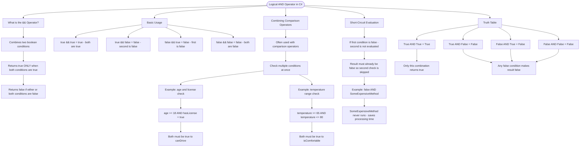

# Logical AND Operator (&&)

The logical AND operator (`&&`) combines two boolean conditions and returns `true` only when both conditions are true.

## Basic Usage

```cs
bool result1 = true && true;   // True - both are true
bool result2 = true && false;  // False - second is false
bool result3 = false && true;  // False - first is false
bool result4 = false && false; // False - both are false
```

## Combining Comparison Operators

The `&&` operator is often used with comparison operators to check multiple conditions:

```cs
int age = 25;
bool hasLicense = true;

// Both conditions must be true
bool canDrive = age >= 18 && hasLicense;  // True

int temperature = 72;
bool isComfortable = temperature >= 65 && temperature <= 80;  // True
```

## Short-Circuit Evaluation

C# uses short-circuit evaluation: if the first condition is `false`, the second condition is not evaluated (since the result must be `false`):

```cs
bool a = false && SomeExpensiveMethod();  // SomeExpensiveMethod() never runs
```

## Truth Table

| Condition A | Condition B | A && B |
| ----------- | ----------- | ------ |
| True        | True        | True   |
| True        | False       | False  |
| False       | True        | False  |
| False       | False       | False  |

|

# Visualization



The flowchart branches into five sections. **What is the && Operator?** establishes the core rule, **Basic Usage** maps all four boolean combinations and their results, **Combining Comparison Operators** shows two real-world examples of chaining conditions, **Short-Circuit Evaluation** explains the performance optimisation of skipping the second condition, and **Truth Table** summarises all combinations converging on the key insight that only one combination returns true.
