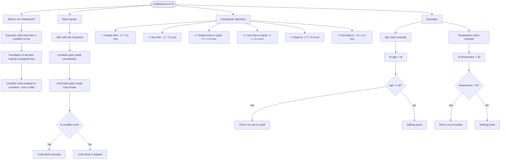

# If Statements

An `if` statement lets you execute code only when a condition is true. It's the foundation of decision-making in programming.

## Basic Syntax

```cs
if (condition)
{
    // Code runs only when condition is true
}
```

The condition must evaluate to a `bool` (true or false). The curly braces `{ }` define the code block that executes.

# Comparison Operators

Use these operators to create conditions:

| Operator | Meaning               | Example          |
| -------- | --------------------- | ---------------- |
| `>`      | Greater than          | `5 > 3` is true  |
| `<`      | Less than             | `2 < 7` is true  |
| `>=`     | Greater than or equal | `5 >= 5` is true |
| `<=`     | Less than or equal    | `3 <= 4` is true |
| `==`     | Equal to              | `5 == 5` is true |
| `!=`     | Not equal to          | `5 != 3` is true |

## Examples

```cs
int age = 18;
if (age >= 18)
{
    Console.WriteLine("You are an adult");
}

int temperature = 30;
if (temperature > 25)
{
    Console.WriteLine("It's hot outside");
}
```

# Visualization



The flowchart branches into four sections. **What is an If Statement?** establishes the concept, **Basic Syntax** traces the structure through to the decision point showing both the true and false paths, **Comparison Operators** maps all six operators with their meanings and examples, and **Examples** walks through both the age and temperature checks as decision trees showing what happens in each case.
