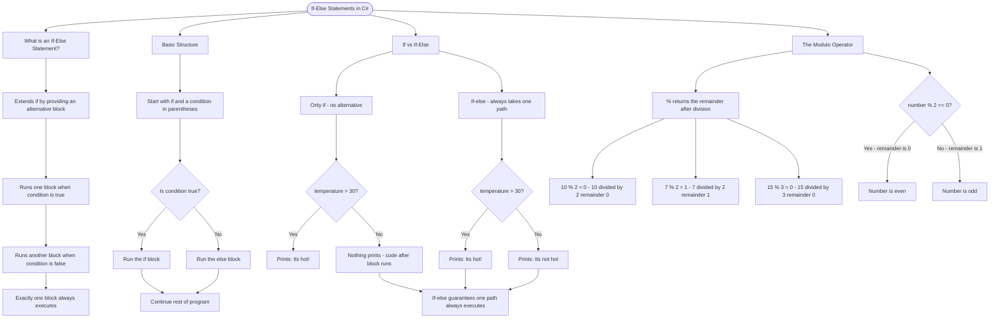

# If-Else Statements

The `if-else` statement extends `if` by providing an alternative block of code when the condition is false.

## Basic Structure

```cs
if (condition)
{
    // Runs when condition is true
}
else
{
    // Runs when condition is false
}
```

## If vs If-Else

With just `if`, code after the block always runs. With `if-else`, exactly one block executes:

```cs
// Only if - no alternative action
if (temperature > 30)
{
    Console.WriteLine("It's hot!");
}

// If-else - always takes one path
if (temperature > 30)
{
    Console.WriteLine("It's hot!");
}
else
{
    Console.WriteLine("It's not hot.");
}
```

## The Modulo Operator

The `%` operator returns the remainder after division. It's perfect for checking divisibility:

| Expression | Result | Explanation             |
| ---------- | ------ | ----------------------- |
| `10 % 2`   | 0      | 10 ÷ 2 = 5, remainder 0 |
| `7 % 2`    | 1      | 7 ÷ 2 = 3, remainder 1  |
| `15 % 3`   | 0      | 15 ÷ 3 = 5, remainder 0 |

A number is **even** if `number % 2 == 0`, and **odd** otherwise.

# Visualization



The flowchart branches into four sections. **What is an If-Else Statement?** establishes the concept, **Basic Structure** traces the decision point showing both the true and false paths converging back together, **If vs If-Else** contrasts the two approaches highlighting how if-else guarantees one path always runs, and **The Modulo Operator** covers the remainder examples and the even/odd decision logic.
