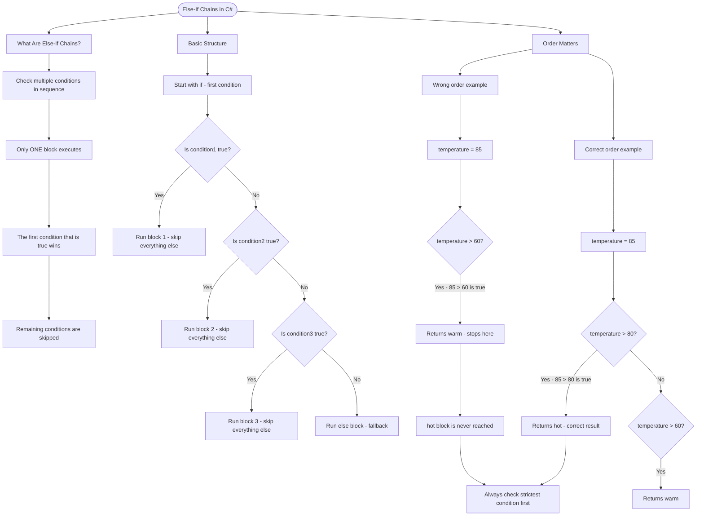

# Else-If Chains

When you need to check multiple conditions in sequence, use an else-if chain. Only one block executes—the first condition that evaluates to `true`.

## Basic Structure

```cs
if (condition1)
{
    // Runs if condition1 is true
}
else if (condition2)
{
    // Runs if condition1 is false AND condition2 is true
}
else if (condition3)
{
    // Runs if both above are false AND condition3 is true
}
else
{
    // Runs if ALL conditions above are false
}
```

## Order Matters!

Conditions are checked from top to bottom. The first `true` condition wins.

```cs
int temperature = 85;

// WRONG ORDER - always returns "warm" for hot days
if (temperature > 60)
{
    return "warm";  // 85 > 60 is true, stops here!
}
else if (temperature > 80)
{
    return "hot";   // Never reached for 85
}

// CORRECT ORDER - check strictest condition first
if (temperature > 80)
{
    return "hot";   // 85 > 80 is true
}
else if (temperature > 60)
{
    return "warm";
}
```

# Visualization



The flowchart branches into three sections. **What Are Else-If Chains?** establishes the key rule that only one block runs, **Basic Structure** traces the full decision chain from top to bottom showing how each condition falls through to the next, and **Order Matters** contrasts the wrong and correct ordering side by side, both converging on the critical takeaway of checking the strictest condition first.
