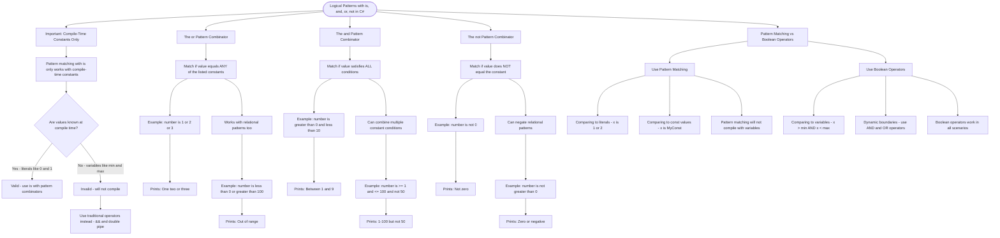

# Logical Patterns with `is`, `and`, `or`, `not`

C# pattern matching allows you to combine conditions using pattern combinators. These make your code more readable when comparing against **compile-time constants**.

## Important: Compile-Time Constants Only

Pattern matching with `is` only works with values known at compile time:

```cs
// ✅ Works - 0 and 1 are compile-time constants
if (number is 0 or 1) { }

// ❌ Does NOT compile - variables are not constants
int min = 0;
int max = 10;
if (number is > min and < max) { }  // Error!

// ✅ For variables, use traditional operators
if (number > min && number < max) { }  // Works!
```

## The `or` Pattern Combinator

```cs
// Match if number equals any of these constant values
if (number is 1 or 2 or 3)
{
    Console.WriteLine("One, two, or three");
}

// Works with constant relational patterns
if (number is < 0 or > 100)
{
    Console.WriteLine("Out of range");
}
```

## The `and` Pattern Combinator

```cs
// Match if number is in a range (constant boundaries)
if (number is > 0 and < 10)
{
    Console.WriteLine("Between 1 and 9");
}

// Combine multiple constant conditions
if (number is >= 1 and <= 100 and not 50)
{
    Console.WriteLine("1-100, but not 50");
}
```

## The `not` Pattern Combinator

```cs
// Match if NOT equal to a constant value
if (number is not 0)
{
    Console.WriteLine("Not zero");
}

// Negate a relational pattern
if (number is not > 0)
{
    Console.WriteLine("Zero or negative");
}
```

## When to Use Pattern Matching vs Boolean Operators

| Scenario                            | Use Pattern Matching | Use Boolean Operators   |
| ----------------------------------- | -------------------- | ----------------------- |
| Compare to literals (1, 2, "hello") | ✅ `x is 1 or 2`     | `x == 1 \|\| x == 2`    |
| Compare to const values             | ✅ `x is MyConst`    | `x == MyConst`          |
| Compare to variables                | ❌ Won't compile     | ✅ `x > min && x < max` |
| Dynamic boundaries                  | ❌ Won't compile     | ✅ Use `&&` and `\|\|`  |

# Visualization



The flowchart branches into five sections. **Compile-Time Constants Only** establishes the key constraint with a decision point between valid and invalid usage, **The or Combinator** covers matching any listed value or relational pattern, **The and Combinator** shows how to match ranges and multiple conditions simultaneously, **The not Combinator** demonstrates negating both equality and relational patterns, and **Pattern Matching vs Boolean Operators** maps the four scenarios to the appropriate approach.
