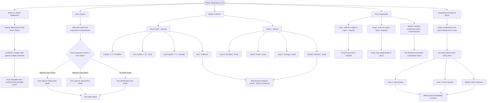

# Switch Statements

A switch statement is a cleaner alternative to long else-if chains when comparing a single value against multiple constants.

## Basic Syntax

```cs
switch (expression)
{
    case value1:
        // code for value1
        break;
    case value2:
        // code for value2
        break;
    default:
        // code if no case matches
        break;
}
```

## Switch vs Else-If

Switch is preferred when checking one variable against many constant values:

```cs
// Else-if chain (verbose)
if (grade == 'A')
    result = "Excellent";
else if (grade == 'B')
    result = "Good";
else if (grade == 'C')
    result = "Average";
else
    result = "Unknown";

// Switch (cleaner)
switch (grade)
{
    case 'A': result = "Excellent"; break;
    case 'B': result = "Good"; break;
    case 'C': result = "Average"; break;
    default: result = "Unknown"; break;
}
```

## Key Components

| Component | Purpose                  | Required?           |
| --------- | ------------------------ | ------------------- |
| `case`    | Defines a value to match | Yes (at least one)  |
| `break`   | Exits the switch block   | Yes (or return)     |
| `default` | Handles unmatched values | No, but recommended |

## Using Return Instead of Break

When inside a method, you can return directly from a case:

```cs
switch (status)
{
    case 1: return "Active";
    case 2: return "Inactive";
    default: return "Unknown";
}
```

# Visualization



The flowchart branches into five sections. **What is a Switch Statement?** establishes the concept, **Basic Syntax** traces the decision flow through case matching down to the exit point, **Switch vs Else-If** contrasts both approaches converging on the same results, **Key Components** maps each component to its purpose and whether it is required, and **Using Return Instead of Break** shows how returning directly from a case exits the method immediately.
