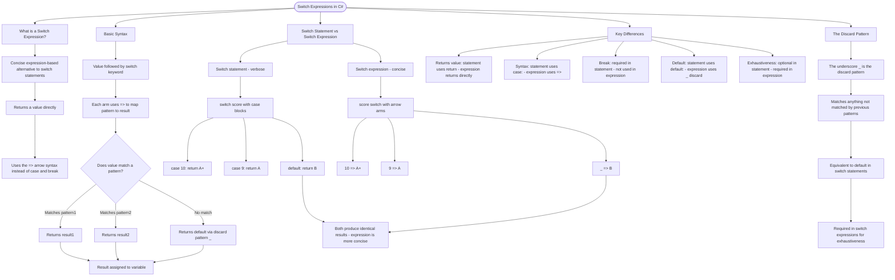

# Switch Expressions

Switch expressions are a concise, expression-based alternative to switch statements. They return a value directly and use the `=>` arrow syntax.

## Basic Syntax

```cs
// Switch expression syntax
var result = value switch
{
    pattern1 => result1,
    pattern2 => result2,
    _ => defaultResult  // discard pattern (default)
};
```

## Switch Statement vs Switch Expression

```cs
// Traditional switch statement (verbose)
string GetGrade(int score)
{
    switch (score)
    {
        case 10:
            return "A+";
        case 9:
            return "A";
        default:
            return "B";
    }
}

// Switch expression (concise)
string GetGrade(int score) => score switch
{
    10 => "A+",
    9 => "A",
    _ => "B"
};
```

## Key Differences

| Feature        | Switch Statement | Switch Expression |
| -------------- | ---------------- | ----------------- |
| Returns value  | Via `return`     | Directly          |
| Uses `case:`   | Yes              | No, uses `=>`     |
| Uses `break`   | Yes              | No                |
| Default        | `default:`       | `_` (discard)     |
| Exhaustiveness | Optional         | Required          |

## The Discard Pattern `_`

The underscore `_` is the discard pattern - it matches anything not matched by previous patterns. It's equivalent to `default` in switch statements.

# Visualization



The flowchart branches into five sections. **What is a Switch Expression?** establishes the concept, **Basic Syntax** traces the pattern matching decision flow down to the result assignment, **Switch Statement vs Switch Expression** contrasts both approaches side by side converging on the same output, **Key Differences** maps the five feature distinctions between the two forms, and **The Discard Pattern** explains the role and requirement of the underscore as a catch-all.
