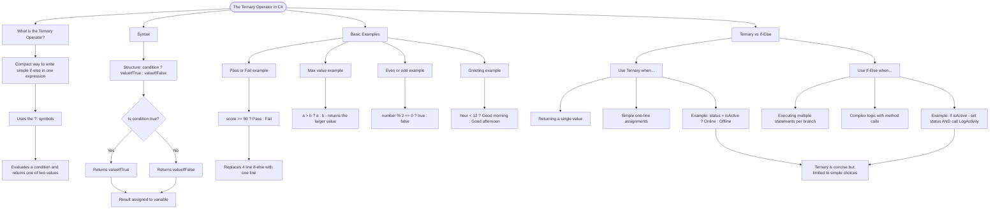

# The Ternary Operator

The ternary operator (`?:`) is a compact way to write simple if-else statements in a single expression. Use it when you need to choose between two values based on a condition.

## Syntax

```cs
condition ? valueIfTrue : valueIfFalse
```

The operator evaluates the condition. If true, it returns the first value; if false, it returns the second value.

## Basic Examples

```cs
// Instead of this:
string result;
if (score >= 50)
    result = "Pass";
else
    result = "Fail";

// Write this:
string result = score >= 50 ? "Pass" : "Fail";

// More examples:
int max = a > b ? a : b;
bool isEven = number % 2 == 0 ? true : false;
string greeting = hour < 12 ? "Good morning" : "Good afternoon";
```

## Ternary vs If-Else

| Ternary                 | If-Else                |
| ----------------------- | ---------------------- |
| Returns a value         | Executes statements    |
| Single expression       | Multiple lines         |
| Best for simple choices | Best for complex logic |

```cs
// Ternary - concise for simple assignments
string status = isActive ? "Online" : "Offline";

// If-Else - better for multiple operations
if (isActive)
{
    status = "Online";
    LogActivity();
}
else
{
    status = "Offline";
    SendNotification();
}
```

# Visualization



The flowchart branches into four sections. **What is the Ternary Operator?** establishes the concept, **Syntax** traces the decision flow showing how the condition maps to one of two return values, **Basic Examples** maps four real-world examples showing how each replaces a verbose if-else, and **Ternary vs If-Else** contrasts the two approaches converging on the key rule that ternary suits simple choices while if-else handles complex multi-statement logic.
