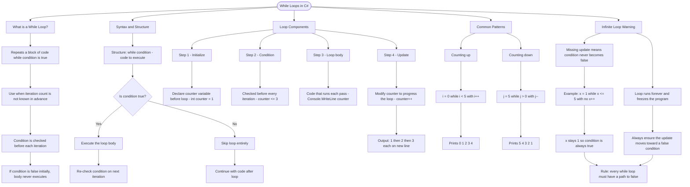

# While Loops

A while loop repeatedly executes a block of code as long as a condition remains true. Use it when you don't know exactly how many times you need to iterate.

## Basic Syntax

```cs
while (condition)
{
    // code to execute
}
```

The loop checks the condition before each iteration. If the condition is false initially, the loop body never executes.

## Loop Components

```cs
int counter = 1;        // 1. Initialize a counter variable
while (counter <= 3)    // 2. Condition checked before each iteration
{
    Console.WriteLine(counter);  // 3. Loop body
    counter++;                   // 4. Update counter (crucial!)
}
// Output: 1, 2, 3 (each on new line)
```

## Common Patterns

```cs
// Counting up
int i = 0;
while (i < 5)
{
    Console.WriteLine(i);  // Prints 0, 1, 2, 3, 4
    i++;
}

// Counting down
int j = 5;
while (j > 0)
{
    Console.WriteLine(j);  // Prints 5, 4, 3, 2, 1
    j--;
}
```

## Infinite Loop Warning

```cs
// DANGER: This runs forever!
int x = 1;
while (x <= 5)
{
    Console.WriteLine(x);
    // Missing x++ means x is always 1!
}
```

Always ensure your loop condition will eventually become false.

# Visualization

Here's the while loop diagram in the same style — plain Mermaid markdown with a summary paragraph, ready to copy:



The flowchart branches into five sections. **What is a While Loop?** establishes the concept and its pre-check behaviour. **Syntax and Structure** traces the decision flow showing how the condition gates entry into the loop body. **Loop Components** walks through the four required steps — initialize, check, execute, and update — grounding them in a concrete counter example. **Common Patterns** contrasts counting up and counting down as the two most typical use cases. **Infinite Loop Warning** maps the danger of a missing update step, with both branches converging on the rule that every while loop must have a clear path to a false condition.
