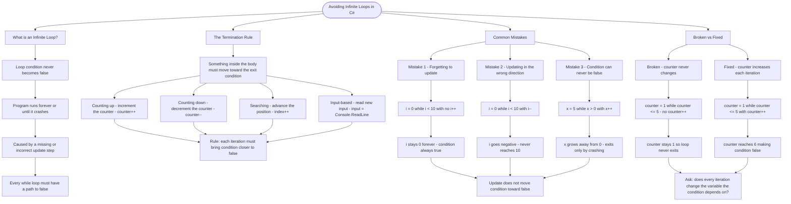

# Avoiding Infinite Loops

An infinite loop occurs when the loop condition never becomes false, causing the program to run forever (or until it crashes).

## hy Loops Become Infinite

```cs
// BROKEN - counter never changes, so counter <= 5 is always true
int counter = 1;
while (counter <= 5)
{
    Console.WriteLine(counter);
    // Missing: counter++;
}

// FIXED - counter increases, eventually making counter <= 5 false
int counter = 1;
while (counter <= 5)
{
    Console.WriteLine(counter);
    counter++;  // This ensures termination!
}
```

## The Termination Rule

Every while loop needs something inside its body that moves it closer to the exit condition:

| Loop Type     | What Must Change           | Example                      |
| ------------- | -------------------------- | ---------------------------- |
| Counting up   | Increment the counter      | `counter++`                  |
| Counting down | Decrement the counter      | `counter--`                  |
| Searching     | Update the search position | `index++`                    |
| Input-based   | Read new input             | `input = Console.ReadLine()` |

## Common Mistakes

```cs
// Mistake 1: Forgetting to update the variable
int i = 0;
while (i < 10)
{
    Console.WriteLine(i);
    // Oops! i never changes
}

// Mistake 2: Updating in the wrong direction
int i = 0;
while (i < 10)
{
    Console.WriteLine(i);
    i--;  // Going the wrong way!
}

// Mistake 3: Condition can never be false
int x = 5;
while (x > 0)
{
    Console.WriteLine(x);
    x++;  // x gets bigger, never reaches 0
}
```

# visualization



The flowchart branches into four sections. **What is an Infinite Loop?** defines the problem and traces it back to a missing or incorrect update step. **The Termination Rule** maps the four loop types — counting, searching, and input-based — converging on the principle that every iteration must bring the condition closer to false. **Common Mistakes** walks through the three classic errors (no update, wrong direction, condition that grows away from false) and shows they all share the same root cause. **Broken vs Fixed** contrasts the two counter examples side by side, ending with a diagnostic question to apply when writing any while loop.
