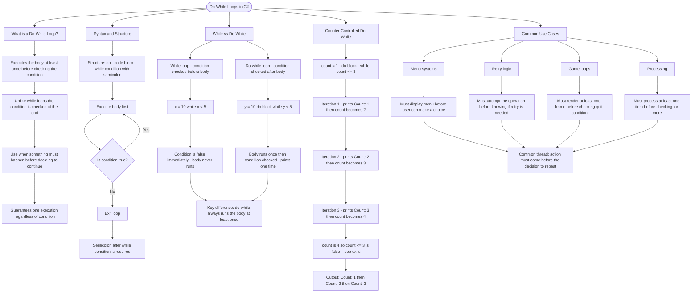

# Do-While Loops

A do-while loop executes its body at least once before checking the condition. This is perfect for scenarios where you need to do something first, then decide whether to continue.

## Syntax

```cs
do
{
    // Code executes at least once
} while (condition);
```

## While vs Do-While

```cs
// While loop - might never execute
int x = 10;
while (x < 5)
{
    Console.WriteLine("This never prints");
}

// Do-while loop - always executes at least once
int y = 10;
do
{
    Console.WriteLine("This prints once!");
} while (y < 5);
```

## Counter-Controlled Do-While

Do-while loops work well with counters when you need at least one iteration:

```cs
int count = 1;
do
{
    Console.WriteLine($"Count: {count}");
    count++;
} while (count <= 3);
// Prints: Count: 1, Count: 2, Count: 3
```

## Common Use Cases

| Use Case     | Why Do-While?                        |
| ------------ | ------------------------------------ |
| Menu systems | Must show menu at least once         |
| Retry logic  | Must attempt operation at least once |
| Game loops   | Must run at least one frame          |
| Processing   | Must process at least one item       |

# Visualization



The flowchart branches into five sections. **What is a Do-While Loop?** establishes the core guarantee — the body always runs at least once because the condition lives at the end. **Syntax and Structure** traces the execution order showing the body fires before the condition is ever evaluated. **While vs Do-While** contrasts both loop types with the same starting value, converging on the key difference that do-while cannot be skipped entirely. **Counter-Controlled Do-While** walks through each iteration of a concrete counter example showing exactly how the output is produced. **Common Use Cases** maps the four canonical scenarios — menus, retries, game loops, and processing — and converges on the shared principle that the action must precede the decision to repeat.
