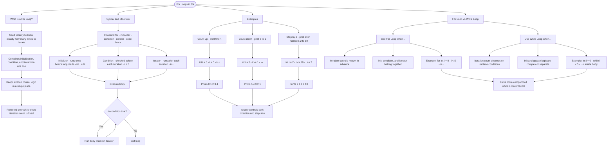

# For Loops

A `for` loop is used when you know exactly how many times you want to iterate. It combines initialization, condition, and iteration into a single line.

## For Loop Syntax

```cs
for (initializer; condition; iterator)
{
    // code to execute each iteration
}
```

Three parts:

- **Initializer**: Runs once before the loop starts (e.g., `int i = 0`)
- **Condition**: Checked before each iteration; loop continues while `true`
- **Iterator**: Runs after each iteration (e.g., `i++`)

## Examples

```cs
// Print 0 to 4
for (int i = 0; i < 5; i++)
{
    Console.WriteLine(i);
}

// Print 5 to 1 (counting down)
for (int i = 5; i >= 1; i--)
{
    Console.WriteLine(i);
}

// Print even numbers 2 to 10
for (int i = 2; i <= 10; i += 2)
{
    Console.WriteLine(i);
}
```

## For Loop vs While Loop

| For Loop                                             | While Loop                              |
| ---------------------------------------------------- | --------------------------------------- |
| Best when iteration count is known                   | Best when iteration count is unknown    |
| Initialization, condition, and iterator in one place | These are separate                      |
| `for (int i = 0; i < 5; i++)`                        | `int i = 0; while (i < 5) { ... i++; }` |

# Visualization



The flowchart branches into four sections. **What is a For Loop?** establishes when to reach for it — any time the iteration count is known — and highlights that all control logic lives in one line. **Syntax and Structure** breaks down the three header parts in order, then traces execution showing how the condition gates each pass and the iterator fires after every body run. **Examples** maps three common patterns — counting up, counting down, and stepping by two — converging on the insight that the iterator alone controls both direction and step size. **For Loop vs While Loop** contrasts both approaches side by side, converging on the rule that for is the compact choice for fixed counts while while handles open-ended or runtime-driven iteration.
