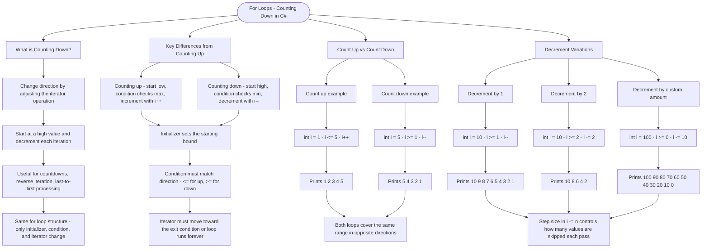

# For Loops - Counting Down

A for loop can count in any direction by changing the loop variable's increment/decrement operation. Counting down is useful for countdowns, reverse iteration, and scenarios where you need to process items from last to first.

## Decrementing with `i--`

```cs
// Count up: start low, end high, increment
for (int i = 1; i <= 5; i++)
{
    Console.WriteLine(i);  // Prints: 1, 2, 3, 4, 5
}

// Count down: start high, end low, decrement
for (int i = 5; i >= 1; i--)
{
    Console.WriteLine(i);  // Prints: 5, 4, 3, 2, 1
}
```

## Key Differences from Counting Up

| Counting Up            | Counting Down         |
| ---------------------- | --------------------- |
| Start at smaller value | Start at larger value |
| Condition: `i <= max`  | Condition: `i >= min` |
| Increment: `i++`       | Decrement: `i--`      |

## Decrement Variations

```cs
// Decrement by 1
for (int i = 10; i >= 1; i--)

// Decrement by 2 (even numbers backwards)
for (int i = 10; i >= 2; i -= 2)  // 10, 8, 6, 4, 2

// Decrement by custom amount
for (int i = 100; i >= 0; i -= 10)  // 100, 90, 80, ..., 0
```

# Visualization



The flowchart branches into four sections. **What is Counting Down?** establishes that direction is controlled entirely by the iterator and that the overall loop structure stays the same. **Key Differences from Counting Up** contrasts the three header parts side by side, converging on two rules — the condition operator must match the direction and the iterator must always move toward making the condition false. **Count Up vs Count Down** pairs the two canonical examples over the same range to make the mirror relationship concrete. **Decrement Variations** maps decrement by 1, by 2, and by a custom step, converging on the insight that the value of n in `i -= n` determines how many values are skipped each pass.
