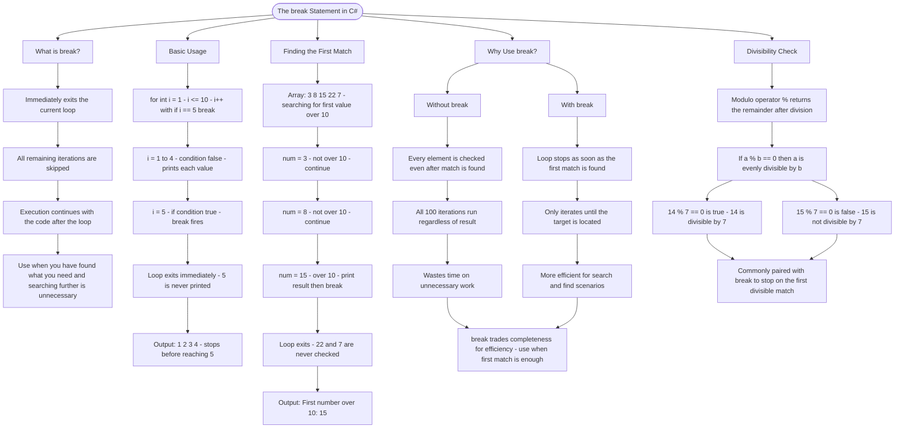

# The break Statement

The `break` statement immediately exits the current loop, stopping all further iterations. Use it when you've found what you're looking for and don't need to continue searching.

## Basic Usage

```cs
for (int i = 1; i <= 10; i++)
{
    if (i == 5)
    {
        break; // Exits the loop when i equals 5
    }
    Console.WriteLine(i);
}
// Prints: 1, 2, 3, 4 (stops before printing 5)
```

## Finding the First Match

```cs
int[] numbers = { 3, 8, 15, 22, 7 };
foreach (int num in numbers)
{
    if (num > 10)
    {
        Console.WriteLine($"First number over 10: {num}");
        break; // Stop searching after finding the first match
    }
}
// Prints: First number over 10: 15
```

## Why Use break?

| Scenario         | Without break    | With break           |
| ---------------- | ---------------- | -------------------- |
| Find first match | Checks all items | Stops at first match |
| Loop iterations  | All 100          | Only until found     |
| Efficiency       | Wastes time      | More efficient       |

## Divisibility Check

To check if a number is divisible by another, use the modulo operator `%`. If `a % b == 0`, then `a` is evenly divisible by `b`.

```cs
14 % 7 == 0  // True - 14 is divisible by 7
15 % 7 == 0  // False - 15 is not divisible by 7
```

# Visualization



The flowchart branches into five sections. **What is break?** establishes that break is an immediate exit — remaining iterations are skipped and execution jumps to the code after the loop. **Basic Usage** traces each iteration of the counting example showing exactly which values print and why 5 is never reached. **Finding the First Match** walks through each array element in sequence, showing the loop advancing until the condition hits on 15 and break fires, leaving the remaining elements unchecked. **Why Use break?** contrasts the without and with cases across three dimensions — coverage, iteration count, and efficiency — converging on the rule that break is the right tool when the first match is all you need. **Divisibility Check** introduces the modulo operator, maps a true and false example, and converges on its natural pairing with break for stopping at the first divisible result.
