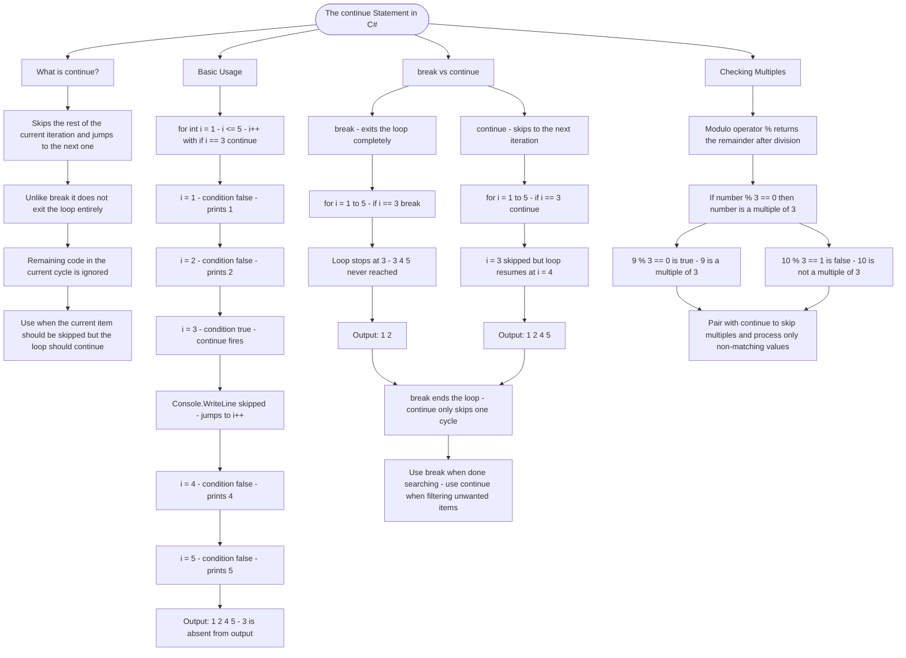

# The continue Statement

The `continue` statement skips the rest of the current loop iteration and jumps to the next one. Unlike `break` which exits the loop entirely, `continue` just moves on to the next cycle.

## Basic Usage

```cs
for (int i = 1; i <= 5; i++)
{
    if (i == 3)
    {
        continue; // Skip when i is 3
    }
    Console.WriteLine(i);
}
// Output: 1, 2, 4, 5 (3 is skipped)
```

## break vs continue

| Statement  | Behavior                  | Use When                       |
| ---------- | ------------------------- | ------------------------------ |
| `break`    | Exits the loop completely | You found what you need        |
| `continue` | Skips to next iteration   | Current item should be ignored |

```cs
// break example - stops at 3
for (int i = 1; i <= 5; i++)
{
    if (i == 3) break;
    Console.WriteLine(i);
}
// Output: 1, 2

// continue example - skips 3
for (int i = 1; i <= 5; i++)
{
    if (i == 3) continue;
    Console.WriteLine(i);
}
// Output: 1, 2, 4, 5
```

## Checking Multiples

Use the modulo operator `%` to check if a number is a multiple of another:

```cs
if (number % 3 == 0)  // True if number is a multiple of 3
```

# Visualization



The flowchart branches into four sections. **What is continue?** establishes the distinction up front — continue skips one cycle while the loop itself keeps running, making it the right tool for filtering rather than stopping. **Basic Usage** traces every iteration of the counting example step by step, showing exactly where continue fires, which line gets skipped, and why 3 is absent from the output. **break vs continue** runs both statements against identical loops converging on the core rule: break ends the search entirely while continue filters out a single unwanted item and moves on. **Checking Multiples** introduces the modulo operator, maps a true and false case, and converges on its natural pairing with continue for skipping over values that match an unwanted pattern.
