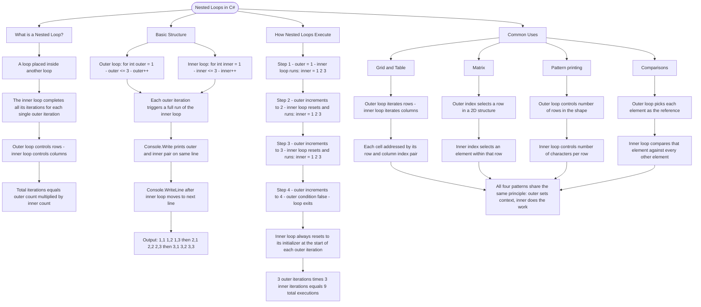

# Nested Loops

A nested loop is a loop placed inside another loop. The inner loop completes all its iterations for each single iteration of the outer loop.

## Basic Structure

```cs
for (int outer = 1; outer <= 3; outer++)
{
    for (int inner = 1; inner <= 3; inner++)
    {
        Console.Write($"({outer},{inner}) ");
    }
    Console.WriteLine(); // New line after inner loop completes
}

// Output:
// (1,1) (1,2) (1,3)
// (2,1) (2,2) (2,3)
// (3,1) (3,2) (3,3)
```

## How Nested Loops Execute

1. Outer loop starts: outer = 1
2. Inner loop runs completely: inner = 1, 2, 3
3. Outer loop increments: outer = 2
4. Inner loop runs completely again: inner = 1, 2, 3
5. This continues until outer loop finishes

## Common Uses

| Pattern          | Description                           |
| ---------------- | ------------------------------------- |
| Grid/Table       | Process rows and columns              |
| Matrix           | Access 2D data structures             |
| Pattern printing | Create shapes with characters         |
| Comparisons      | Compare each element with every other |

# Visualization



The flowchart branches into four sections. **What is a Nested Loop?** establishes the core mechanic — the inner loop runs to completion on every single outer iteration — and introduces the multiplication rule for calculating total executions. **Basic Structure** maps the two loop headers and traces the output line by line, showing how `Console.Write` and `Console.WriteLine` work together to produce the grid layout. **How Nested Loops Execute** walks through all three outer iterations step by step, highlighting that the inner loop always resets to its initializer and converging on the total of nine executions. **Common Uses** maps the four canonical patterns — grids, matrices, pattern printing, and comparisons — converging on the unifying principle that the outer loop always sets the context while the inner loop performs the repeated work within it.
