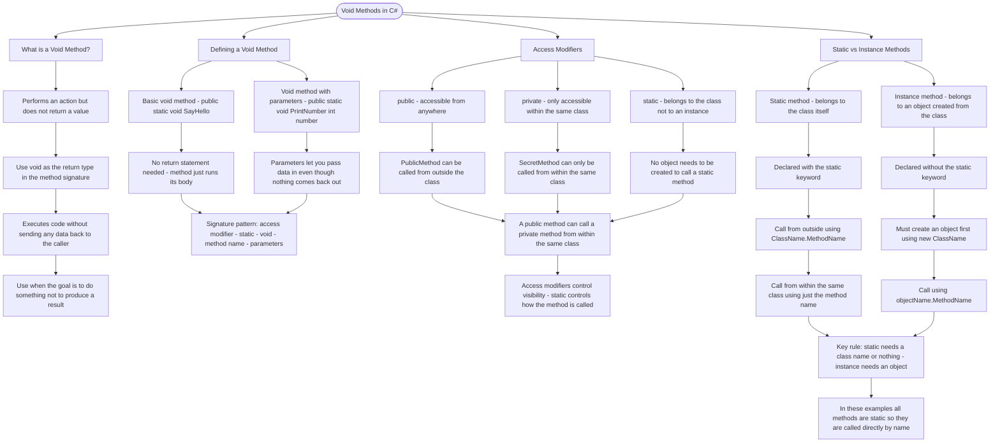

# Void Methods

A **void method** is a method that performs an action but does not return a value. Use `void` as the return type when your method should execute code without sending data back to the caller.

## Defining a Void Method

```cs
// Basic void method syntax
public static void SayHello()
{
    Console.WriteLine("Hello!");
}

// Void method with parameters
public static void PrintNumber(int number)
{
    Console.WriteLine(number);
}
```

## Access Modifiers

Methods can have different access levels:

| Modifier  | Description                           |
| --------- | ------------------------------------- |
| `public`  | Accessible from anywhere              |
| `private` | Only accessible within the same class |
| `static`  | Belongs to the class, not an instance |

```cs
// Private method - can only be called from within Solution class
private static void SecretMethod()
{
    Console.WriteLine("This is private!");
}

// Public method - can be called from outside
public static void PublicMethod()
{
    SecretMethod(); // Calling private method from within the class
}
```

## Calling Static vs Instance Methods

How you call a method depends on whether it's **static** or an **instance method**:

```cs
public class Example
{
    // Static method - belongs to the class itself
    public static void StaticMethod()
    {
        Console.WriteLine("I'm static!");
    }

    // Instance method - belongs to an object
    public void InstanceMethod()
    {
        Console.WriteLine("I'm an instance method!");
    }
}

// Calling static methods - use the class name or call directly within the same class
Example.StaticMethod();  // From outside the class
StaticMethod();          // From within the same class

// Calling instance methods - requires creating an object first
Example obj = new Example();
obj.InstanceMethod();  // Must call on an instance
```

**Key difference**: Static methods can be called directly using the class name (or just the method name within the same class). Instance methods require you to create an object first using `new`.

Here, we're using `static` methods, so you can call them directly by name within the same class.

# Visualization



The flowchart branches into four sections. **What is a Void Method?** establishes the core concept — void signals that a method does something rather than producing a result, so no return value is ever sent back to the caller. **Defining a Void Method** maps the basic and parameterised forms, converging on the full signature pattern and the rule that no return statement is required. **Access Modifiers** traces the three modifiers independently, converging on the distinction that access modifiers control visibility while static controls how the method is invoked. **Static vs Instance Methods** contrasts the two calling patterns step by step, converging on the key rule that static methods need only a class name or nothing at all while instance methods always require an object to be created first.
