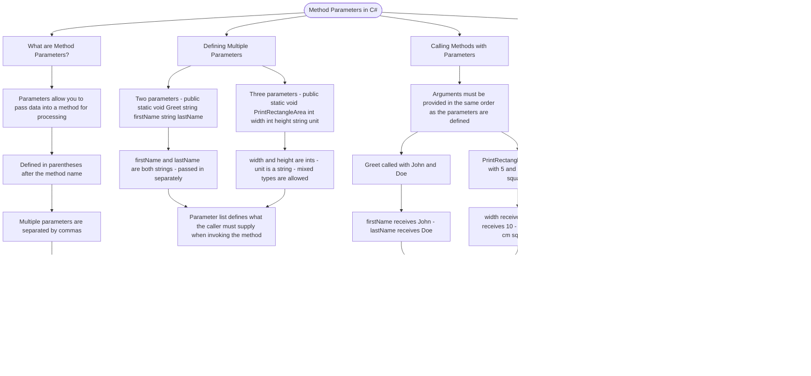

# Method Parameters

Methods can accept multiple parameters, allowing you to pass data into them for processing. Parameters are defined in the parentheses after the method name, separated by commas.

## Defining Multiple Parameters

```cs
// A method with two parameters
public static void Greet(string firstName, string lastName)
{
    Console.WriteLine("Hello, " + firstName + " " + lastName);
}

// A method with three parameters
public static void PrintRectangleArea(int width, int height, string unit)
{
    Console.WriteLine(width * height + " " + unit);
}
```

## Calling Methods with Parameters

When calling a method, you must provide arguments in the same order as the parameters are defined:

```cs
// The arguments match the parameter order
Greet("John", "Doe");        // firstName = "John", lastName = "Doe"
PrintRectangleArea(5, 10, "cm²");  // width = 5, height = 10, unit = "cm²"
```

## Calling from Main

The `Main` method is the entry point of your program. You can call other methods from within `Main`:

```cs
public static void Main()
{
    SayHello();      // Call a method with no parameters
    Add(10, 20);     // Call a method with two parameters
}
```

# Visualization



The flowchart branches into four sections. **What are Method Parameters?** establishes that parameters are typed placeholders defined in the signature that tell the caller exactly what data to supply. **Defining Multiple Parameters** maps the two and three parameter forms, converging on the rule that every parameter needs a type and a name and that mixed types across parameters are perfectly valid. **Calling Methods with Parameters** traces how each argument at the call site maps positionally to its corresponding parameter, converging on the warning that order mismatches assign wrong values silently with no compiler error. **Calling from Main** establishes Main as the program entry point, contrasts a no-argument call against a two-argument call, and converges on the principle that Main orchestrates program flow by invoking methods in sequence.
