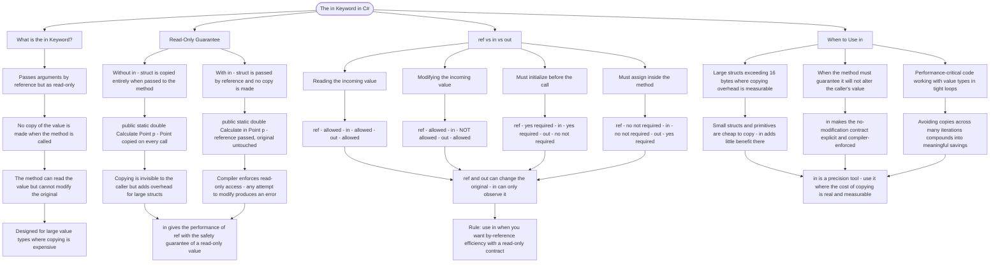

# The in Keyword

The `in` keyword passes arguments **by reference as read-only**, allowing efficient passing of large value types while guaranteeing the method cannot modify the original value.

## Why Use in Parameters?

```cs
// Without 'in': the struct is copied (expensive for large structs)
public static double Calculate(Point p) { ... }

// With 'in': passed by reference, no copy made
public static double Calculate(in Point p) { ... }
```

## Read-Only Guarantee

Unlike `ref`, the `in` keyword prevents modification:

```cs
public static void Process(in Point p)
{
    // p.X = 10;  // ERROR: Cannot modify - it's read-only!
    double x = p.X;  // OK: Reading is allowed
}
```

## Comparison: ref vs in vs out

| Modifier | Can Read | Can Modify | Must Initialize Before | Must Assign Inside |
| -------- | -------- | ---------- | ---------------------- | ------------------ |
| `ref`    | Yes      | Yes        | Yes                    | No                 |
| `in`     | Yes      | No         | Yes                    | No                 |
| `out`    | Yes      | Yes        | No                     | Yes                |

## When to Use in

- Passing large structs (more than 16 bytes) to avoid copying overhead
- When you want to guarantee the method won't change the value
- For performance-critical code with value types

# Visualization



The flowchart branches into four sections. **What is the in Keyword?** establishes the dual promise — by-reference passing for efficiency and a read-only contract for safety — positioning it as the tool for large value types where copying overhead matters. **Read-Only Guarantee** contrasts the without-in and with-in forms of the same method, converging on the point that the compiler actively enforces the read-only restriction and any modification attempt produces an error. **ref vs in vs out** maps all three modifiers across the four behavioural dimensions — reading, modifying, pre-call initialization, and post-call assignment — converging on the rule that ref and out can alter the original while in can only observe it. **When to Use in** maps the three conditions that justify reaching for it — large structs, explicit no-modification contracts, and performance-critical loops — converging on the guideline that in is a precision tool whose benefit only materialises where the cost of copying is real.
