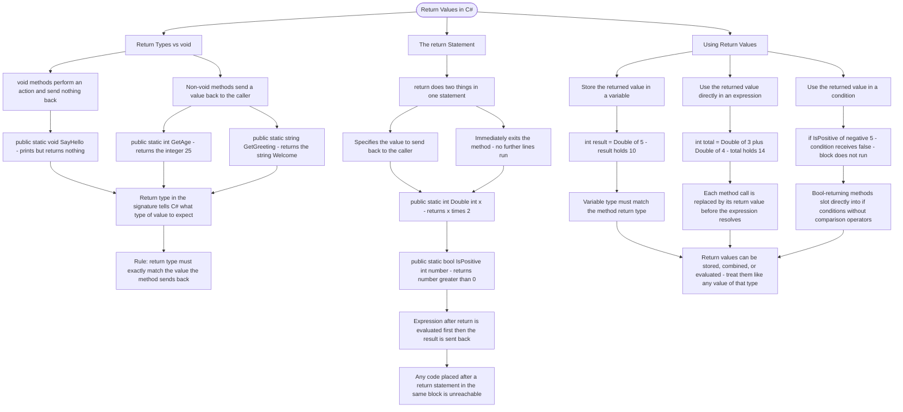

# Return Values

Methods can send data back to the code that called them using the `return` statement. The return type in the method signature tells C# what type of value will be returned.

## Return Types vs void

```cs
// void method - performs an action, returns nothing
public static void SayHello()
{
    Console.WriteLine("Hello!");
}

// Method with return type - sends a value back
public static int GetAge()
{
    return 25;
}

public static string GetGreeting()
{
    return "Welcome!";
}
```

## The return Statement

The `return` statement does two things:

1. Specifies the value to send back
2. Immediately exits the method

```cs
public static int Double(int x)
{
    return x * 2;  // Returns the result and exits
}

public static bool IsPositive(int number)
{
    return number > 0;  // Returns true or false
}
```

## Using Return Values

```cs
// Store the returned value in a variable
int result = Double(5);  // result = 10

// Use directly in expressions
int total = Double(3) + Double(4);  // total = 14

// Use in conditions
if (IsPositive(-5))
{
    Console.WriteLine("Positive!");
}
```

# Visualization



The flowchart branches into three sections. **Return Types vs void** contrasts void methods against non-void methods across three concrete examples, converging on the rule that the declared return type must exactly match what the method sends back. **The return Statement** establishes the two simultaneous effects — sending a value and exiting immediately — and converges on the consequence that any code placed after a return in the same block is unreachable. **Using Return Values** maps the three ways a caller can consume a returned value — storing it, combining it in an expression, and using it in a condition — converging on the principle that a return value behaves exactly like any other value of that type wherever it appears.
