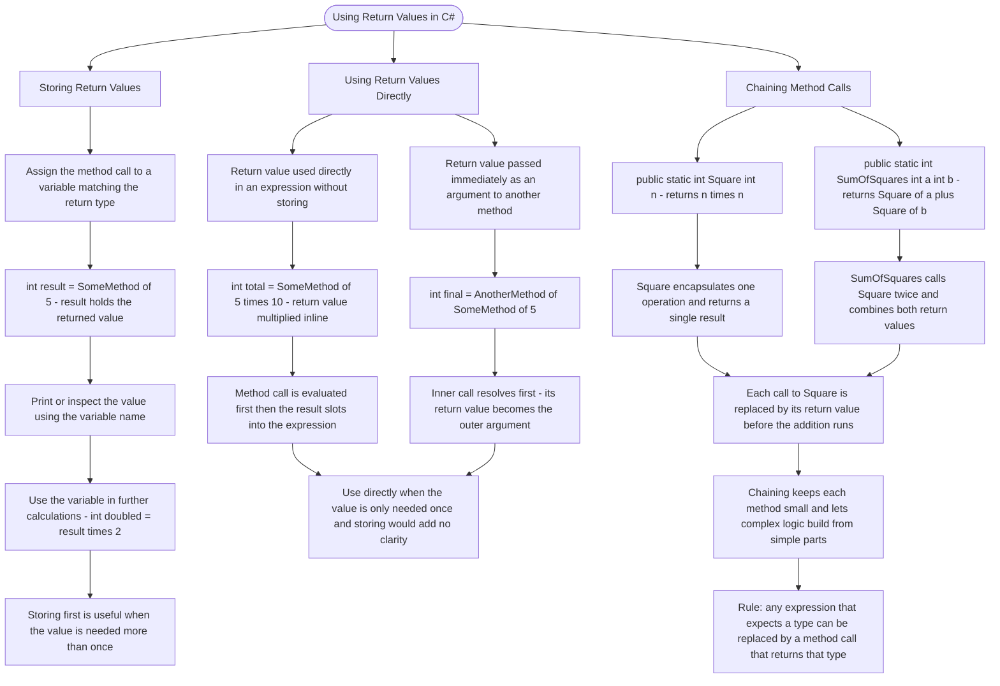

# Using Return Values

When a method returns a value, you can store it in a variable or use it directly in expressions. This lets you build complex logic from simple, reusable methods.

## Storing Return Values

```cs
// Store the return value in a variable
int result = SomeMethod(5);
Console.WriteLine(result);

// Use the variable in further calculations
int doubled = result * 2;
```

## Using Return Values Directly

```cs
// Use the return value directly in an expression
int total = SomeMethod(5) * 10;

// Pass the return value to another method
int final = AnotherMethod(SomeMethod(5));
```

## Chaining Method Calls

```cs
// Methods can use other methods' return values
public static int Square(int n)
{
    return n * n;
}

public static int SumOfSquares(int a, int b)
{
    return Square(a) + Square(b);
}
```

# Visualization



The flowchart branches into three sections. **Storing Return Values** traces the pattern of capturing a return value in a variable, showing how it can be printed and reused in further calculations, converging on the guideline that storing is the right choice when the value is needed more than once. **Using Return Values Directly** maps two inline patterns — using the return value in an expression and passing it straight into another method — converging on the principle that the method call is always evaluated first and its result slots in as if it were a literal value. **Chaining Method Calls** walks through the Square and SumOfSquares pair to show how one method can consume another's return value, converging on the rule that any expression expecting a given type can be replaced by a method call that returns that same type.
