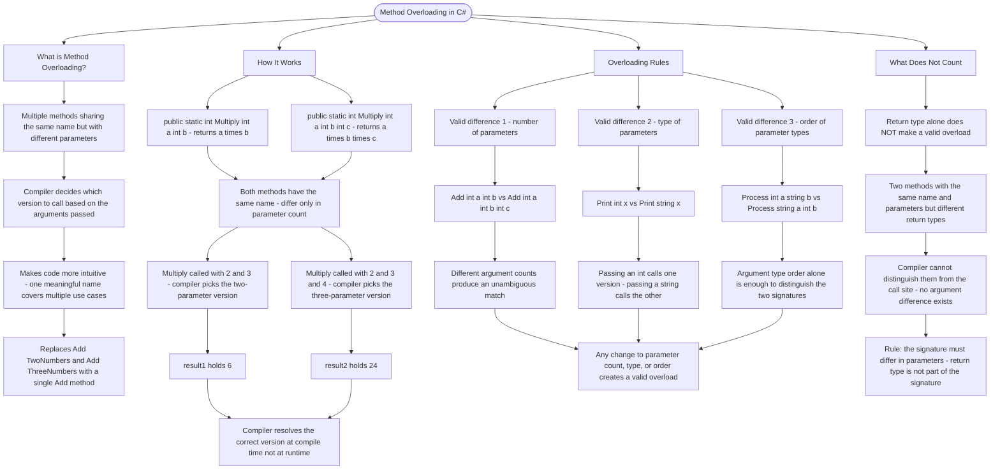

# Method Overloading

Method overloading lets you create multiple methods with the same name but different parameters. The compiler determines which method to call based on the arguments you pass.

## Why Use Overloading?

Overloading makes your code more intuitive. Instead of having `AddTwoNumbers()` and `AddThreeNumbers()`, you can simply have `Add()` that works with different numbers of arguments.

## How It Works

```cs
// Two methods with the same name but different parameter counts
public static int Multiply(int a, int b)
{
    return a * b;
}

public static int Multiply(int a, int b, int c)
{
    return a * b * c;
}

// The compiler picks the right one based on arguments
int result1 = Multiply(2, 3);       // Calls first version: 6
int result2 = Multiply(2, 3, 4);    // Calls second version: 24
```

## Overloading Rules

| Valid Difference         | Example                                                  |
| ------------------------ | -------------------------------------------------------- |
| Number of parameters     | `Add(int a, int b)` vs `Add(int a, int b, int c)`        |
| Type of parameters       | `Print(int x)` vs `Print(string x)`                      |
| Order of parameter types | `Process(int a, string b)` vs `Process(string a, int b)` |

**Note**: Return type alone does NOT make methods different enough to overload.

# Visualization



The flowchart branches into four sections. **What is Method Overloading?** establishes the core concept — same name, different parameters — and shows how it replaces a family of awkwardly named methods with a single intuitive one. **How It Works** traces both Multiply versions from definition through to the compiler selecting the correct one at each call site, converging on the point that resolution happens at compile time. **Overloading Rules** maps the three valid forms of difference — parameter count, parameter type, and parameter type order — converging on the rule that any change to the parameter signature is sufficient to create a valid overload. **What Does Not Count** isolates the one thing that is not enough on its own, converging on the rule that return type is not part of the signature the compiler uses to distinguish methods.
